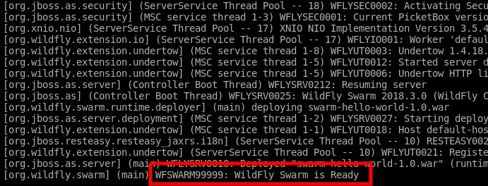
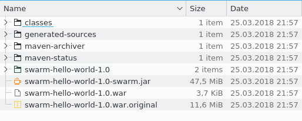

# Lab : Getting Familiar with WildFly Swarm


#### Lab Environment
You can perform this lab on VM or your PC. Run the following commands one by one to setup lab environment:

`apt-get update && apt-get --assume-yes install default-jdk && apt-get --assume-yes install maven && apt-get --assume-yes install git`

`git clone https://github.com/athertahir/development-with-wildfly.git`

`cd development-with-wildfly/chapter02`

# Introducing WildFly
Most of you have probably heard about JBoss Application Server; WildFly is its successor. It is an open source implementation of the Java EE specification, and, more importantly in the context of this book, it is the base of Swarm project.

WildFly has an extensible architecture, which enables building differently sized distributions on top of its high-performance core, which, as we will learn in the next chapter, is utilized by Swarm to a great extent.

**Performance**

When you hear the phrase Java EE application server, the first thing that may come to your mind is the word heavyweight, as this is the way in which application servers are often described. It's worth noting however that the Java EE specification doesn't prescribe for its implementation to be slow and bloated, and many modern application servers (WildFly included) indeed don't follow that nonexistent rule.

WildFly starts within seconds and is highly optimized in terms of resource usage. You are going to see it many times throughout the book. We are going to run a number of WildFly based services and tests, all of them running immediately and with small memory footprint.

**Extensible nature**

As mentioned earlier, WildFly's default distribution is a Java EE application server with all necessary libraries. Owing to the extensible nature of WildFly, you can easily create your own server distribution. It is possible to trim unused subsystems; a good example here may be the web profile, which contains only those subsystems that are needed to serve web pages and may be treated as a web server. It is also easy to add your own extensions to provide additional functions.

As you will learn later in this book, Swarm takes advantage of a great detail from both of these abilities, automatically trimming the server so that it uses only the libraries needed by your service, and also provides a bunch of microservices-dedicated extensions.

**Note** Whatever distribution you are going to use, whether it is a trimmed-down web server, a full distribution extended with your own subsystems, or Swarm microservices, it can take advantage of all the features provided by the core, such as high performance, modular classloading, and a mature management layer.

**Deployment model**

Application servers provide enterprise functionality collocated in a JVM, which can be used by multitenant applications. Those applications can share services, be deployed and undeployed in real time, and communicate with each other in a JVM.

In this book, we will concentrate on Swarm-based microservices, but note that this is a valid architecture model with benefits that should be taken into consideration when choosing the right architectural style for the problems that you are solving.

Components of a monolithic application are located in the same JVM, and they can communicate directly within its boundaries. In such an application, you don't have to think about a number of problems inherent to distributed systems. If you decide to distribute your application, you will have to take care of network failures, service discovery, monitoring service availability, and dealing with their failures, just to name a few problems. Also, in a monolithic application, you can use out-of-the-box technologies, such as transactions or security, that have been thoroughly tested and have proven to work well.

# Meet WildFly Swarm
As we discussed earlier, the application server provides the possibility to deploy and manage multiple applications within the same instance. Also, the Java EE-compliant application server provides an implementation of all specifications gathered around Java EE umbrella so that each application that conforms to it can use it.

Such a functionality is not necessary for all application architectures. In services developed in our example application, we might not care much about management, hot redeployment, and support for all Java EE libraries. The reason for that is that we will be developing small focused microservices. If a microservice is updated, we can just kill its container and restart its new version. Also, at the time of service creation, we will be able to determine all the libraries that it will use during its operations. Because of that, we will be able to build the executable JAR with only those necessary dependencies, minimizing the runtime size and memory usage. The tool that is most suitable for such a purpose is WildFly Swarm.

WildFly Swarm is a child project of WildFly, whose goal is to make microservice application development easy. Before we take a deeper look at Swarm behavior, let's get a feel for it using our first Hello World JAX-RS Swarm service.

# Java EE application
Let's create a simple Java EE application with a REST resource, which uses the GET method to serve the Hello world! message:

```
package org.packt.swarm;

import javax.ws.rs.GET;
import javax.ws.rs.Path;
import javax.ws.rs.Produces;

//1
@Path("/")
public class HelloWorldResource {

    //2
    @GET
    //3
    @Path("hello")
    @Produces({ "text/plain" })
      public String hello() {
        return "Hello World!";
    }
}
```

In the listing above, we create a simple resource taking advantage of JAX-RS annotations; we define the main path for the whole class (1) and create the "hello" method, which is annotated with GET(2) and Path(3) annotations so that the "hello" method is executed when the HTML get method is invoked on a "/hello" path.

Furthermore, we have to define the application on thePath(1)rootto bootstrap the web application:

```
package org.packt.swarm;

import javax.ws.rs.ApplicationPath;
import javax.ws.rs.core.Application;

//1
@ApplicationPath("/")
public class HelloWorldApplication extends Application {
}
```

Finally, we have to configure pom.xml:

```
<?xml version="1.0" encoding="UTF-8"?>
<project xmlns="http://maven.apache.org/POM/4.0.0"
xmlns:xsi="http://www.w3.org/2001/XMLSchema-instance"
xsi:schemaLocation="http://maven.apache.org/POM/4.0.0 http://maven.apache.org/xsd/maven-4.0.0.xsd">
    <modelVersion>4.0.0</modelVersion>

    <!-- 1 -->
    <groupId>org.packt.swarm</groupId>
    <artifactId>swarm-hello-world</artifactId>
    <version>1.0</version>
    <packaging>war</packaging>

    (...)

    <!-- 2 -->
    <dependencyManagement>
        <dependencies>
            <dependency>
                <groupId>org.jboss.spec</groupId>
                <artifactId>jboss-javaee-7.0</artifactId>
                <version>${version.jboss.spec.javaee.7.0}</version>
                <type>pom</type>
                <scope>import</scope>
            </dependency>
        </dependencies>
    </dependencyManagement>

    <!-- 3 -->
    <dependencies>
        <dependency>
            <groupId>org.jboss.spec.javax.ws.rs</groupId>
            <artifactId>jboss-jaxrs-api_2.0_spec</artifactId>
            <scope>provided</scope>
        </dependency>
    </dependencies>

    <build>
        <!-- 4 -->
        <plugins>
            <plugin>
                <artifactId>maven-war-plugin</artifactId>
                <version>${version.war.plugin}</version>
                <configuration>
                    <failOnMissingWebXml>false</failOnMissingWebXml>
                </configuration>
            </plugin>
        </plugins>
    </build>

</project>
```

We are creating the application with the war type (1) so that it can be used as a web application. We are referencing the Java EE (2) and jaxrs API (3) so that we are able to use annotations mentioned in the preceding paragraph. Finally, we have to tweak the war plugin to inform it that we will not use the web.xml file.

That's it. This is the simple REST HelloWorld resource. We will now be able to build it and deploy it on a Java EE application server.

#### Adapting to WildFly Swarm
Now we all know how to create Java EE applications, described previously, but we are here to learn how to use WildFly Swarm, so let's adopt the preceding application for it. Let's roll up our sleeves as we have some hard work to do now.

We have to modify pom.xml:

```
(...)

    <dependencies>
        <!-- 1 -->
        <dependency>
            <groupId>org.wildfly.swarm</groupId>
            <artifactId>jaxrs</artifactId>
            <version>${version.wildfly.swarm}</version>
        </dependency>
    </dependencies>

    <build>
        <plugins>
            (...)
            <!-- 2 -->
            <plugin>
                <groupId>org.wildfly.swarm</groupId>
                <artifactId>wildfly-swarm-plugin</artifactId>
                <version>${version.wildfly.swarm}</version>
                <executions>
                    <execution>
                        <goals>
                            <goal>package</goal>
                        </goals>
                    </execution>
                </executions>
            </plugin>
        </plugins>
    </build>

</project>
```

We had to add dependencies to Swarm's JAX-RS module (1). Such modules are called fractions and you will learn more about them in the next chapter. Please note that we don't need to configure the JAX-RS API dependency directly as it will be provided as the JAX-RS fraction dependency.

Later, we had to configure WildFly Swarm's Maven plugin, which is responsible for building Swarm microservices (2). You will also learn more about it in the next chapter.

That's it. Congratulations! You have just created your first WildFly Swarm application.

### Does it really work?
Before we look in greater detail at what happened, let's run the application to prove that it is indeed working. Open the console, enter the root directory of the application, and run the following command:

`cd swarm-hello-world`

`mvn wildfly-swarm:run`

The Maven command runs successfully:



We can open the web browser and enter the address of our application `<host-ip>:8080/hello`

**What has just happened here?**

The application works indeed. Let's look step by step what has just happened:

- Maven build has been run. A standard maven package plugin has created the war archive, which included classes described previously (and which can be as well deployed into the standard application server).
- The Swarm plugin built a runtime for our application. The runtime is based on WildFly-core and contains only the libraries needed by the service application.
- The plugin has built a runnable JAR, which combines the runtime and the application.
- Since we have specified the run goal, the plugin has started the service immediately after its creation.

Let's take a look at the target directory to note the build output:



As you can see in the preceding screenshot, besides the standard Maven target artifact, one more JAR is created: swarm-hello-world-1.0-swarm.jar. This is the runnable microservice. Its name is created from the archive's name to which the Swarm suffix is added. Also, note that the size of the service is 47.5 MB. It is slightly bigger than WildFly web-server profile. The reason for that is that some more libraries (enabling REST services) have to be added to the server.

`ls -ltr target`

This example was supposed to give you an initial feel for WildFly Swarm. As you see, the responsibility of the developer here is to implement a business functionality and configure the Swarm maven plugin. Swarm takes care of the rest: it creates the server with all libraries necessary to make those features work and connects the archive with this server to create a runnable microservice. Owing to this convention-over-configuration style and automatic server creation, a lot of the configuration burden is taken away from the developer so he/she can concentrate on business functionality development. Obviously, this standard behavior can be changed—you will learn more about it in subsequent parts of this book.