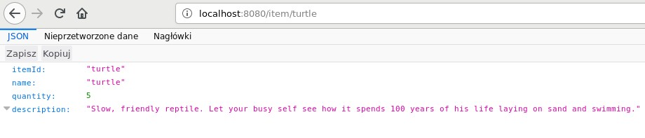

# Lab : Right-Sizing Your Services

#### Lab Environment
You can perform this lab on VM or your PC. Run the following commands one by one to setup lab environment:

`apt-get update && apt-get --assume-yes install default-jdk && apt-get --assume-yes install maven && apt-get --assume-yes install git`

`git clone https://github.com/athertahir/development-with-wildfly.git`

`cd development-with-wildfly/chapter03`

Catalog service
---------------

* * * * *

In the first chapter, you learned the basic architecture of the pet
store sample application and the services that constitute it. In this
and the next chapter, we will be working with the catalog service. To
recall, this is the service responsible for providing the information
about pets available in the store. We are going to introduce that simple
functionality now. In the next three chapters, we will modify that code
in order to show you different features and configuration options of
WildFly Swarm. Let's look at the initial version.

### Draft version

We will start by introducing the first, draft version of the service,
which we will examine and extend later.

### Note

Examples reference: `chapter3/catalog-service-jaxrs`.

As in the preceding chapter, we have to start with
the`pom.xml`:

```
<?xml version="1.0" encoding="UTF-8"?>
<project xmlns="http://maven.apache.org/POM/4.0.0"
xmlns:xsi="http://www.w3.org/2001/XMLSchema-instance"
xsi:schemaLocation="http://maven.apache.org/POM/4.0.0 http://maven.apache.org/xsd/maven-4.0.0.xsd">
    <modelVersion>4.0.0</modelVersion>

    <groupId>org.packt.swarm.petstore</groupId>
    <artifactId>catalog-service-jaxrs</artifactId>
    <version>1.0</version>
    <packaging>war</packaging>

    (...)

    <dependencies>
        <!-- 1 -->
        <dependency>
            <groupId>org.wildfly.swarm</groupId>
            <artifactId>jaxrs</artifactId>
            <version>${version.wildfly.swarm}</version>
        </dependency>
    </dependencies>

    <build>
        <plugins>
            <plugin>
                <artifactId>maven-war-plugin</artifactId>
                <version>${version.war.plugin}</version>
                <configuration>
                    <failOnMissingWebXml>false</failOnMissingWebXml>
                </configuration>
            </plugin>
            <!-- 2 -->
            <plugin>
                <groupId>org.wildfly.swarm</groupId>
                <artifactId>wildfly-swarm-plugin</artifactId>
                <version>${version.wildfly.swarm}</version>
                <executions>
                    <execution>
                        <goals>
                            <goal>package</goal>
                        </goals>
                    </execution>
                </executions>
            </plugin>
        </plugins>
    </build>

</project>
```

We have to add the dependency to JAX-RS fraction (1) and configure the
WildFly Swarm plugin (2). Let's move to the code now.

We will start with a simple domain class, `Item`, which
contains information about the pets available in the store:


```
package org.packt.swarm.petstore.catalog.model;

public class Item {


private String itemId;
    private String name;
    private int quantity;

    private String description;

    public String getItemId() {
return itemId;
}

public void setItemId(String itemId) {
this.itemId = itemId;
}

public String getName() {
return name;
}

public void setName(String name) {
this.name = name;
}

public int getQuantity() {
return quantity;
}

public void setQuantity(int quantity) {
this.quantity = quantity;
}

public String getDescription() {
return description;
}

public void setDescription(String description) {
this.description = description;
}
}
```

As you can see in the preceding code, this is a simple class containing
`itemId`, `name`, description of the pet, and the
quantity available in the store. As in the `Hello World`
example, we have to initialize our JAX-RS application:


```
package org.packt.swarm.petstore.catalog;

import javax.ws.rs.ApplicationPath;
import javax.ws.rs.core.Application;

@ApplicationPath("/")
public class CatalogApplication extends Application {
}
```

Finally, we are ready to write a simple JAX-RSresource that will serve
up information about available pets from the in-memory
`HashMap`:

```
package org.packt.swarm.petstore.catalog;

import org.packt.swarm.petstore.catalog.model.Item;

import javax.ws.rs.GET;
import javax.ws.rs.Path;
import javax.ws.rs.PathParam;
import javax.ws.rs.Produces;
import javax.ws.rs.core.MediaType;
import javax.ws.rs.core.Response;
import java.util.HashMap;
import java.util.Map;

//1
@Path("/")
public class CatalogResource {

    //2
    private Map<String, Item> catalog = new HashMap<>();

    public CatalogResource(){
        Item turtle = new Item();
        turtle.setItemId("turtle");
        turtle.setName("turtle");
        turtle.setQuantity(5);
        turtle.setDescription("Slow, friendly reptile. Let your busy self see how it spends 100 years of his life laying on sand and swimming.");
        catalog.put("turtle", turtle);
    }

    //3
    @GET
    @Path("item/{itemId}")
    @Produces(MediaType.APPLICATION_JSON)
    public Response searchById(@PathParam("itemId") String itemId) {
        try {
            Item item = catalog.get(itemId);
            return Response.ok(item).build();
        } catch (Exception e) {
            return Response.status(Response.Status.BAD_REQUEST).entity(e.getMessage()).build();
        }
    }

}
```

Our resource is located at the root path of an application (1). In the
first version, we have implemented the catalog as a`HashMap`
and populated it with the first pet—`turtle` (2). The
`searchById` method will be invoked when the `GET`
method is invoked with the `"item"` address and the
`itemId` parameter (3).

We can build and deploy the application:

`cd catalog-service-jaxrs && mvn wildfly-swarm:run`

We can open the web browser and enter the address of our application `<host-ip>:8080/item/turtle`


If we enter the address of the **`catalog-service`** in the web browser,
we will be able to find our first pet in the catalog:




Thin and hollow JARs
--------------------

* * * * *

As we said before, during the standard Maven plugin operation, the
resulting application contains both the Swarm server and the application
that is deployed on it. We can change that behavior. Let's suppose that
we deploy our application in the cloud and later push new changes to its
code. Since it is the application code that changes in most cases, we
would like to create the container with the server in the cloud and
later push only code to it. How are we able to do it? By using hollow
JARs.

### Using hollow JARs

You are able to configure the Maven plugin to build hollow JARs, which
contain the swarm server without the actual application deployed on it.
Let's return to the JAX-RS + CDI example again to show how it works.

### Note

Example reference: `chapter03/catalog-service-hollow-jar`.

The first thing that we will need to do is configure the Maven plugin:

```
(...)

    <build>
        <plugins>
            <plugin>
                <artifactId>maven-war-plugin</artifactId>
                <version>${version.war.plugin}</version>
                <configuration>
                    <failOnMissingWebXml>false</failOnMissingWebXml>
                </configuration>
            </plugin>
            <plugin>
                <groupId>org.wildfly.swarm</groupId>
                <artifactId>wildfly-swarm-plugin</artifactId>
                <version>${version.wildfly.swarm}</version>
                <!-- 1 -->
                <configuration>
                    <hollow>true</hollow>
                </configuration>
                <executions>
                    <execution>
                        <goals>
                            <goal>package</goal>
                        </goals>
                    </execution>
                </executions>
            </plugin>
        </plugins>
    </build>
(...)
```


The only thing that we have to do is to enable the hollow configuration
parameter (1). When we build the application and navigate to our target
directory, we will see the following output:

`cd ~/development-with-wildfly/chapter03/catalog-service-hollow-swarm && mvn wildfly-swarm:run`

`ls -ltr target`


As you can see in the preceding screenshot, one directory ends with the
`-hollow-swarm` suffix. This is our hollow jar without the
deployed application. When running it, we must provide the name of the
application that we will deploy on the created server. We will be able
to do it in the following way:

```
java jar catalog-1.0-hollow-swarm.jar catalog-1.0.war
```

This will start the container and run our application. As a result, it
will behave in the same way as the original example.

### Using thin JARs

You will be able to create a thin JAR. A thin JAR does not contain its
Maven dependencies and loads them during application startup from a
local or remote Maven repository.

### Note

Example reference: `chapter3/catalog-service-thin-jar`.

Let's take a look at an example:


```
(...)

    <build>
        <plugins>
            <plugin>
                <artifactId>maven-war-plugin</artifactId>
                <version>${version.war.plugin}</version>
                <configuration>
                    <failOnMissingWebXml>false</failOnMissingWebXml>
                </configuration>
            </plugin>
            <plugin>
                <groupId>org.wildfly.swarm</groupId>
                <artifactId>wildfly-swarm-plugin</artifactId>
                <version>${version.wildfly.swarm}</version>
                <!-- 1 -->
                <configuration>
                    <bundleDependencies>false</bundleDependencies>
                </configuration>
                <executions>
                    <execution>
                        <goals>
                            <goal>package</goal>
                        </goals>
                    </execution>
                </executions>
            </plugin>
        </plugins>
    </build>

(...)
```

When we build the application and look at the target directory, we get
the following result:

`cd ~/development-with-wildfly/chapter03/catalog-service-thin-jar && mvn wildfly-swarm:run`

`ls -ltr target`


Note that in the preceding scenario, all the JARs are very small with
the runnable JAR of `744` KB.

You also have the possibility to mix thin JARs with hollow JARs. The
runnable JAR does not contain the application that has to be deployed on
it, so it has to be run in the same way as in the preceding example:


```
java jar catalog-1.0-hollow-swarm.jar catalog-1.0.war
```

Both the server and the deployment do not contain bundled dependencies,
so they have to be loaded from the Maven repository using the
application deployment.
