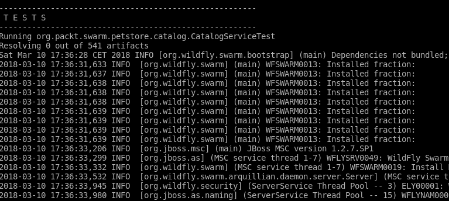
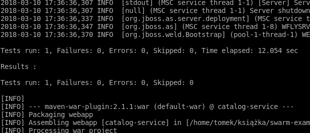
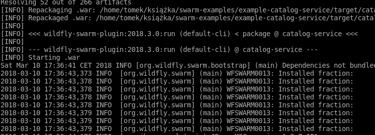

# Lab : Testing Your Services with Arquillian
In this episode, you will learn how to test your microservices. For this purpose, we will use Arquillian, a test framework designed to test software components using their dedicated runtime, instead of creating mock-based unit tests. This is the framework developer to work seamlessly WildFly Swarm and, effectively,a framework of choice for it.

We will introduce Arquillian and present the purpose of the project and its main features. Later, you will learn how to develop, write, and configure tests for your services based on practical examples.

#### Lab Environment
You can perform this lab on VM or your PC. Run the following commands one by one to setup lab environment:

`apt-get update && apt-get --assume-yes install default-jdk && apt-get --assume-yes install maven && apt-get --assume-yes install git`

`git clone https://github.com/athertahir/development-with-wildfly.git`

`cd development-with-wildfly/chapter05`


Introducing Arquillian
----------------------

We all know the benefits of unit testing. They are simple and run immediately. They isolate the components of your application and allow you to test them one by one, providing the coverage of each component's usage scenarios. Unfortunately, unit tests have their shortcomings too. When you cover your application with unit tests, they will confirm that each component of your application works correctly. Obviously, based only on that information, you cannot deduce that your whole application works correctly—that is a reason to have integration tests. You have to test your components inside the environment in which they will operate to ensure that the application works correctly as a whole. The problem with integration tests so far has been that they tend to be complicated to configure and took a long time to execute. Here is where Arquillian steps in. The aim of the project is to make integration tests as fast and simple to configure as unit tests.

As you may recall, in Chapter 2, Getting Familiar with WildFly Swarm, we emphasized how fast modern runtimes are. Arquillian takes advantage of that and lets you easily configure the tests that run on the same runtime your application will run. If, for example, you are developing a Java EE application, you can configure Arquillian to run the test on the application server of your choice. Since modern applications servers are very fast, the test will run immediately. On the other hand, you will be able to test your application in its real environment with all its dependencies. 

In our case, a runtime for each service is assembled by WildFly Swarm. Arquillian allows you to configure the tests for such cases too. Let's find out how.

Testing Swarm microservices with Arquillian
-------------------------------------------

* * * * *

In this section, you will learn how Arquillian can be used to test
microservices created with Swarm. As you learned in previous chapters,
Swarm builds a runtime containing only fractions needed by a given
service, starts it, and then deploys an archive on it, creating the
microservice.

Arquillian, as we have just learned, tests an application on its
dedicated runtime. It starts the runtime, deploys the tested code on it,
and performs the test. Let's configure such a test for our JAX-RS and
the CDI catalog service example, and explain what we are doing step by
step. 

### Note

For examples: refer to `chapter05/catalog-service-simple-test`.

First of all, we have to provide all the necessary dependencies:

```
(...)

    <dependencyManagement>
        <dependencies>
            <!-- 1 -->
            <dependency>
                <groupId>org.jboss.arquillian</groupId>
                <artifactId>arquillian-bom</artifactId>
                <version>${version.arquillian}</version>
                <type>pom</type>
                <scope>import</scope>
            </dependency>
        </dependencies>
    </dependencyManagement>

    <dependencies>
        <dependency>
            <groupId>org.wildfly.swarm</groupId>
            <artifactId>jaxrs</artifactId>
            <version>${version.wildfly.swarm}</version>
        </dependency>
        <dependency>
            <groupId>org.wildfly.swarm</groupId>
            <artifactId>cdi</artifactId>
            <version>${version.wildfly.swarm}</version>
        </dependency>
        <!-- 2 -->
        <dependency>
            <groupId>junit</groupId>
            <artifactId>junit</artifactId>
            <version>${version.junit}</version>
            <scope>test</scope>
        </dependency>
        <!-- 3 -->
        <dependency>
            <groupId>org.jboss.arquillian.junit</groupId>
            <artifactId>arquillian-junit-container</artifactId>
            <scope>test</scope>
        </dependency>
        <!-- 4 -->
        <dependency>
            <groupId>org.wildfly.swarm</groupId>
            <artifactId>arquillian</artifactId>
            <version>${version.wildfly.swarm}</version>
            <scope>test</scope>
        </dependency>

    </dependencies>

(...)

</project>
```

1.  Firstly, we added Arquillian to `dependencyManagement`(1).
2.  Secondly, Arquillian can be integrated with various testing
    libraries. As we are going to use JUnit, we have to provide the
    dependency to it (2).

3.  To run the Arquillian test with JUnit, we have to provide JUnit
    integration artifact (3).
4.  Thirdly, we have to tell Arquillian which runtime to use—we are
    doing this by providing a dependency to an adapter library. In our
    case, this obviously is a Swarm adapter (3).

Now we are ready to take a look at the code. To recall, the service in
this example contains only one item, which is added manually:

```
package org.packt.swarm.petstore.catalog;

import org.packt.swarm.petstore.catalog.model.Item;

import javax.enterprise.context.ApplicationScoped;
import java.util.HashMap;
import java.util.Map;

@ApplicationScoped
public class CatalogService {

private Map<String, Item> catalog = new HashMap<>();

    public CatalogService(){
        Item turtle = new Item();
turtle.setItemId("turtle");
turtle.setName("turtle");
turtle.setQuantity(5);
turtle.setDescription("Slow, friendly reptile. Let your busy self see how it spends 100 years of his life laying on sand and swimming.");
catalog.put("turtle", turtle);
}

public Item searchById(String itemId){
return catalog.get(itemId);
}

}
```

Now it is time to write a `test` class. An Arquillian-based
test runs in the following way: Arquillian looks for the static method
annotated with
the `org.jboss.arquillian.container.test.api.Deployment`
annotation. The method has to return the `ShrinkWrap` archive.

Arquillian will start the container and deploy the returned archive on
it. After that, the methods are annotated with `org.junit`. A
test runs inside the container. Let's look at all this in our sample
test:

```
package org.packt.swarm.petstore.catalog;

import org.jboss.arquillian.container.test.api.Deployment;
import org.jboss.arquillian.junit.Arquillian;
import org.jboss.shrinkwrap.api.ShrinkWrap;
import org.jboss.shrinkwrap.api.asset.EmptyAsset;
import org.jboss.shrinkwrap.api.spec.JavaArchive;
import org.junit.Assert;
import org.junit.Test;
import org.junit.runner.RunWith;
import org.packt.swarm.petstore.catalog.model.Item;

import javax.inject.Inject;

//1
@RunWith(Arquillian.class)
public class CatalogServiceTest {

    //2
    @Deployment
    public static JavaArchive createDeployment() {
        return ShrinkWrap.create(JavaArchive.class)
                .addClasses(Item.class,CatalogService.class)
                .addAsManifestResource(EmptyAsset.INSTANCE, "beans.xml");
    }

    //3
    @Inject
    CatalogService catalogService;

    //4
    @Test
    public void testSearchById() {
        Assert.assertEquals(catalogService.searchById("turtle").getName(),"turtle");
}
}
```

In the beginning, we told JUnit to run the test using Arquillian test
controller. To do that, we annotated the test with
the `@RunWith` annotation, specifying
`Arquillian.class` as the test runner (1).

The `createDeployment` (2) method, as its name suggests, is
responsible for creating the deployment archive, which will be deployed
on the configured container. To inform Arquillian about it, we have to
annotate this method with the `@Deployment` annotation. The
method is static and returns the `ShrinkWrap` archive. As the
test method is being run inside the container, we are able to inject its
resources. In our example, we have to inject the
`CatalogService` class that we are going to test (3) and
the `Item` class on which it depends.

Finally, the `Test` method checks whether the
`searchById` method works correctly (4).

Let's run the test now:

`mvn clean wildfly-swarm:run`

You will note that the test has been deployed inside the Swarm
container:



It finishes successfully:



Finally, the Swarm microservice starts (because we used
the `wildfly-swarm:run` command):



Note that Swarm, as in examples from the previous chapters, used the
when-missing discovery mechanism and created the container with all the
necessary fractions. That container was used for both testing and
running the resulting microservices.

As you could notice in the preceding screenshot, the only file that we
changed was the `pom.xml` file, so the switch from AS to Swarm
was again very simple. However, this had drawbacks too: not changing
the `CatalogTest` class meant that we were again creating the
archive manually—Swarm can do it for us when the service is created so
can't it create the deployment test too? It can—let's learn how.

### The default deployment

As we have just hinted, Swarm can create the default test deployment.

### Note

For example, refer to `chapter05/catalog-service-test-default-deployment`.

We will modify the `Test` class so that the archive is created
automatically:

```
package org.packt.swarm.petstore.catalog;

import org.jboss.arquillian.junit.Arquillian;
import org.junit.Assert;
import org.junit.Test;
import org.junit.runner.RunWith;
import org.wildfly.swarm.arquillian.DefaultDeployment;

import javax.inject.Inject;


@RunWith(Arquillian.class)
//1
@DefaultDeployment
public class CatalogServiceTest {

@Inject
CatalogService catalogService;

@Test
public void testSearchById() {
        Assert.assertEquals(catalogService.searchById("turtle").getName(),"turtle");
}
}
```

In order to tell Swarm to create the test deployment automatically, we
have to annotate the class with the
`org.wildfly.swarm.arquillian.DefaultDeployment` annotation
(1). That's just it. If you run the test now, you will see the same
result as in the preceding paragraph. Note that we didn't use the
`@Deployment` annotated static method as we did in the
preceding example.

### Testing from a standalone client

This time, we would like to test the application from a standalone
client. Let's learn how to do it.

### Note

For examples, refer to `chapter05/catalog-service-database-test-standalone`.

First of all, we have to add a bunch of dependencies to the
`pom.xml` file:

```
(...)

    <dependencies>
    (...)
        <dependency>
            <groupId>org.wildfly.swarm</groupId>
            <artifactId>arquillian</artifactId>
            <version>${version.wildfly.swarm}</version>
            <scope>test</scope>
        </dependency>

        <!-- 1 -->
        <dependency>
            <groupId>org.jboss.resteasy</groupId>
            <artifactId>resteasy-client</artifactId>
            <version>${resteasy.version}</version>
            <scope>test</scope>
        </dependency>

        <!-- 2 -->
        <dependency>
            <groupId>org.jboss.resteasy</groupId>
            <artifactId>resteasy-jackson-provider</artifactId>
            <version>${resteasy.version}</version>
            <scope>test</scope>
        </dependency>

    </dependencies>
(...)
```

We have to add a dependency to the JAX-RS client that we will use to
make REST invocations on our service. As we will use
the `resteasy` implementation, we will add its client (1). We
would also need a library to parse the JSON response, hence
the`resteasy-jackson-provider` is added (2).

Let's take a look at the code of the test that does it:

```
package org.packt.swarm.petstore.catalog;

import org.jboss.arquillian.container.test.api.Deployment;
import org.jboss.arquillian.container.test.api.RunAsClient;
import org.jboss.arquillian.junit.Arquillian;
import org.jboss.arquillian.test.api.ArquillianResource;
import org.jboss.shrinkwrap.api.ShrinkWrap;
import org.jboss.shrinkwrap.api.asset.EmptyAsset;
import org.jboss.shrinkwrap.api.spec.WebArchive;
import org.junit.Assert;
import org.junit.BeforeClass;
import org.junit.Test;
import org.junit.runner.RunWith;
import org.packt.swarm.petstore.catalog.model.Item;
import org.wildfly.swarm.Swarm;
import org.wildfly.swarm.arquillian.CreateSwarm;

import javax.ws.rs.client.Client;
import javax.ws.rs.client.ClientBuilder;
import javax.ws.rs.client.WebTarget;
import java.net.URL;

@RunWith(Arquillian.class)
public class CatalogServiceTest {

@Deployment
public static WebArchive createDeployment() {
return ShrinkWrap.create(WebArchive.class)
                //1
                .addClasses(Item.class, CatalogService.class, CatalogResource.class, CatalogApplication.class)
                .addAsResource("datasources.yml")
                .addAsResource("META-INF/persistence.xml")
                .addAsResource("META-INF/load.sql")
                .addAsManifestResource(EmptyAsset.INSTANCE, "beans.xml");
}

@CreateSwarm
public static Swarm createSwarm() throws Exception {
        Swarm swarm = new Swarm();
ClassLoader cl = CatalogServiceTest.class.getClassLoader();
URL dataSourcesConfig = cl.getResource("datasources.yml");
swarm.withConfig(dataSourcesConfig);
        return swarm;
}

    //2
    private static Client client;

    //3
    @BeforeClass
    public static void setUpClient() {
        client = ClientBuilder.newClient();
    }

    //4
    @ArquillianResource
    private URL url;

    //5
    private Item testEndpoint(String itemId) {
        WebTarget target = client.target(url + "item/"+itemId);
        return target.request("application/json").get(Item.class);
    }

@Test
    //6
@RunAsClient
public void testSearchById() {
        //7
        Assert.assertEquals(testEndpoint("turtle").getName(),"turtle");
        Assert.assertEquals(testEndpoint("hamster").getName(),"hamster");
}
}
```

There is quite a bit of stuff that we had to implement. Let's analyze it
one by one.

As we are going to test the REST endpoint, we have to add classes that
will expose it, that is, `CatalogResource` and
`CatalogApplication` (1).

Arquillian is able to find out the URL of a created service and inject
it into the test. To obtain such an object, we have to annotate the URL
field with
the `org.jboss.arquillian.test.api.ArquillianResource`
annotation (4).

We have implemented the convenience test method, which makes invocations
to the service and obtains item instances, based on the ID (5).

The most important addition to the test is annotating the
`test` methods with
the `org.jboss.arquillian.container.test.api.RunAsClient` *annotation.
As a result, the test will run from Maven's JVM as a standalone client.
We are using the test annotated in this way in order to create a test
that will assert the correct behavior of our service, based on
invocations from the test JVM (6).


# Summary
In this episode, you learned what Arquillian is and how you can use it to test Swarm microservices. You also learned how to configure Arquillian to automatically create a Swarm container, how to modify the container configuration, and how to test the created microservice from within the container and from a standalone client.