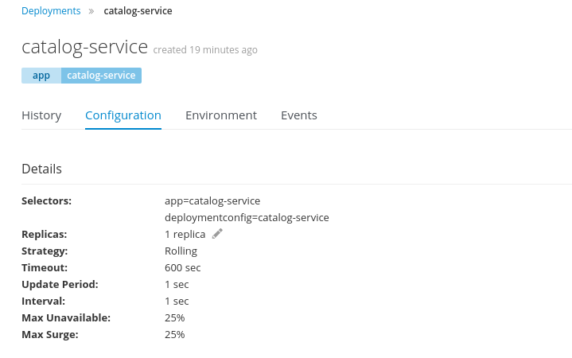
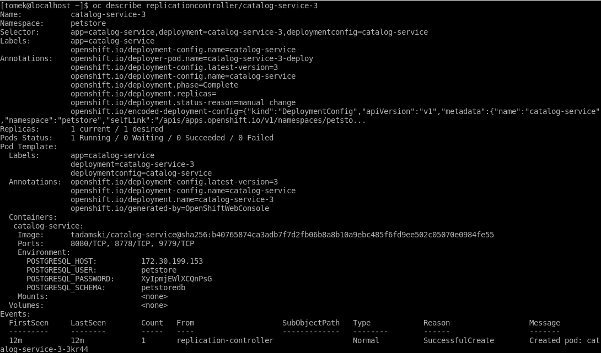
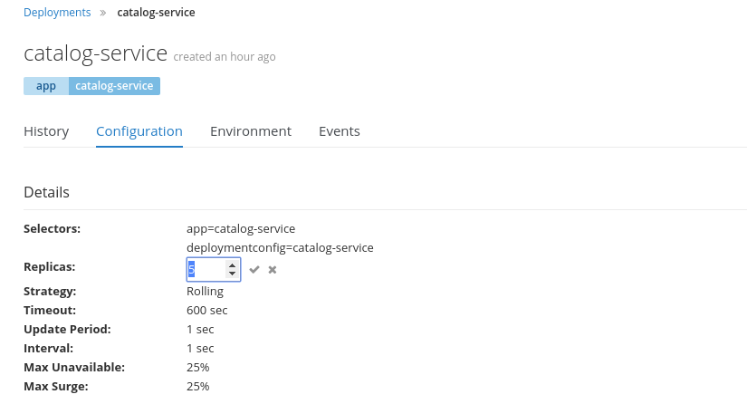
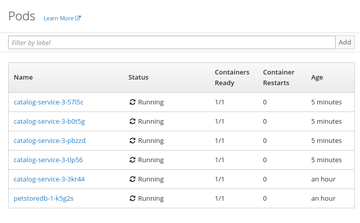
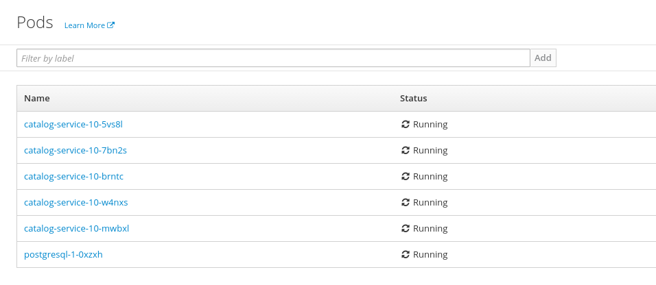
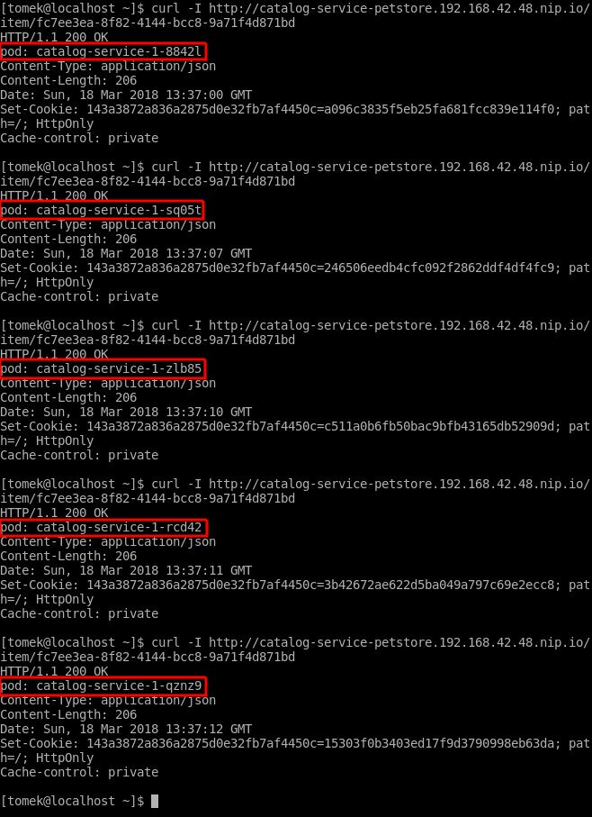

# Lab : Scaling and Connecting Your Services - Load balancing
In this chapter, we will look in greater detail at the process of deploying, scaling, and connecting your applications. You have already learned the basic information about deploying services to the OpenShift cloud. Now it's time to extend this knowledge and learn how to use it in practice.

Let's start with deployments.

<span style="color:red"> *Important:*</span>

Before starting this guide, complete these openshift labs: https://www.katacoda.com/athertahir/courses/cloud-development-with-wildfly

#### Pre-reqs:
- https://www.katacoda.com/athertahir/courses/cloud-development-with-wildfly/cloud-development-with-wildfly-chapter-07

Deployments
-----------

* * * * *

Let's examine what happens under the hood during deployment of our
services. We are going to continue work on an example from the previous
chapter.

### Note

Examples reference: `chapter8/catalog-service-openshift-load-balancing`.

You have to open the web console, and navigate to **`Applications`**|
**`Deployments`** | **`catalog-service`**:



Now we will be able to see the deployment configuration. This is the
graphical representation of OpenShift's
`DeploymentConfiguration` object.

OpenShift adds another layer on top of Kubernetes to provide a more convenient and
productive programmer experience. It does that, among other things, by
extending the object model of Kubernetes.
`DeploymentConfiguration` and **`Deployments`** are OpenShift
objects that extend the Kubernetes object model.

The `DeploymentConfiguration` object manages the creation of
the **`Deployments`** objects. It contains all the necessary information
to create **`Deployments`**, which, as its name suggests, represents an
instance of deployment. When one of the Deployments triggers happens,
the old deployment object is replaced by the new one. All of the
deployment objects are based on `DeploymentConfiguration`.
**`Deployments`**, among others, encapsulate
Kubernetes's `ReplicationController` object. Let's understand
it in greater detail.

### Learning the basics of ReplicationController

`ReplicationController`contains the following information: the
pod template, selector, and the number of replicas. Let's examine those
further.

The pod template is basically a pod definition. It contains information
about the containers, volumes, ports, and labels. Every pod created by
this replication controller will be started using this pod template. The
selector is used to determine which pods are governed by
this `ReplicationController`. Finally, the number of replicas
is the number of pods that we want to be running. 

Kubernetes works in the following way: it monitors the current state of
the cluster, and if that state is different from the desired state it
takes actions so that the desired state is restored. The same thing
happens with `ReplicationControllers`.
`ReplicationController` continuously monitors the number of
pods that are associated with it. If the number of the pods is different
than the desired number, it starts or stops pods so that the desired
state is restored. The pod is started using the pod template.

Let's examine the `ReplicationController` that Kubernetes
created for our catalog-service. To do this, we will use the CLI:


As you will notice in the preceding screenshot, there are three
replication controllers created for **`catalog-service`**. This is the
case because of each redeployment of the application results in the
creation of a new deployment object with its own replication controller.
Note that only **`catalog-service-3`** has the desired number of
instances greater than **`0`** —the previous deployments have been made
inactive when the new deployment was taking place.

Let's take a look at the description of the active controller:



The selector has threelabels: app, deployment, and deployment-config. It
unambiguously identifies the pods associated with the given deployment.

### Note

Exactly the same labels are used in the pod template. Other parts of the
pod template contain the image from which the container is built, and
the environment variables that we provided during the creation of the
service. Finally, the number of current and desired replicas is set, by
default, to one. 

OK. So how do we scale our service so that it runs on more than one
instance? Let's move to the web console again. We need to navigate to
**`Application`** | **`Deployments`** again and enter the
**`catalog-service`** configuration:



To scale the **`catalog-service`** application, we have to adjust the
**`Replicas`** field to the number of instances that we want to
have. That's it.

When we look at the `ReplicationControllers` in the
`oc`, we will see the following information:


The number of pods has been changed to **`5`**. As we saw in
the `oc` output, additional pods have been started and we now
have five instances. Let's check in the console (navigate
to **`Applications`** | **`Pods`**):



OpenShift has indeed scaled our application according to our needs. 

After having worked with OpenShift for some time, you should be able to
see what we meant in [Chapter
6](https://subscription.packtpub.com/book/web_development/9781786462374/6),
*Deploying Applications on the Cloud with OpenShift*, when we wrote that
OpenShift builds an effective and easy-to-use application development
environment on top of Kubernetes. The preceding example showed how it
works very well: Kubernetes is responsible for making sure that the
state of the cluster equals the description provided. In the preceding
example, this description is provided by a
`ReplicationController` object (which is part of the
Kubernetes object model). Note, however, that OpenShift has abstracted
away all the nitty-gritty details from us. We have only provided the
information such as the address of the code repository or number of
replicas that we want to have. The OpenShift layer abstracts away the
technical details of cluster configuration and provides us with
convenient, easy-to-use tools, which allow the programmer to concentrate
on the development.

Let's return to our main topic. The next thing that we will configure is
**load balancing**.

Load balancing
--------------

* * * * *

We have just learned how to scale our service. The next natural step is
to configure the load balancer. The good news is that OpenShift will do
most of the stuff automatically for us.

Openshift service is reached using a virtual cluster IP. To
understand how load balancing works, let's understand how cluster IP is
implemented.

As we have also learned here, each node in a Kubernetes cluster runs a
bunch of services, which allow a cluster to provide its functionality.
One of those services is **kube-proxy**. Kube-proxy runs on every node
and is, among other things, responsible for service implementation.
Kube-proxy continuously monitors the object model describing the cluster
and gathers information about currently active services and pods on
which those services run. When the new service appears, kube-proxy
modifies the iptables rules so that the virtual cluster's IP is routed
to one of the available pods. The iptables rules are created so that the
choice of the pod is random. Also, note that those IP rules have to be
constantly rewritten to match the current state of the cluster.

A kube-proxy runs on every node of the cluster. Owing to that, on each
node, there is a set of iptables rules, which forward the package to the
appropriate pods. As a result, the service is accessible from each node
of the cluster on its virtual cluster IP.

What's the implication of that from the client service perspective? The
cluster infrastructure is hidden from the service client. The client
doesn't need to have any knowledge about nodes, pods, and their dynamic
movement inside the cluster. They just invoke the service using its IP
as if it was a physical host. 

Let's return to our example and look at the load balancing of our host.
Let's return to the example in which we are working within this chapter.
We statically scaled our catalog service to five instances. Let's enter
the web console in order to look at all the pods on which the
application currently runs:



Let's trace to which pods are the requests forwarded. In order to
achieve that, we implemented a simple REST filter:

```
package org.packt.swarm.petstore.catalog;

import javax.ws.rs.container.ContainerResponseFilter;
import javax.ws.rs.container.ContainerRequestContext;
import javax.ws.rs.container.ContainerResponseContext;
import javax.ws.rs.ext.Provider;
import java.io.IOException;

//1
@Provider
public class PodNameResponseFilter implements ContainerResponseFilter {
public void filter(ContainerRequestContext req, ContainerResponseContext res)
throws IOException
    {
//2
        res.getHeaders().add("pod",System.getenv("HOSTNAME"));
}
}
```

The preceding filter adds a `"pod"` property to the response
headers. The filter will be evaluated after the response is processed
(1). On each pod, there is a `"HOSTNAME"` environment variable
set. We can use this variable and add it to the response metadata (2).


Let's run our new application:

`oc delete all -l app=catalog-service`

`oc new-app wildflyswarm-10-centos7~https://github.com/PacktPublishing/Hands-On-Cloud-Development-with-WildFly.git --context-dir=chapter8/catalog-service-openshift-load-balancing/ --name=catalog-service`

`oc expose svc/catalog-service`

`oc scale --replicas=3 dc catalog-service`

As a result, we are ready to trace the load balancing:



Run this command multiple times in the terminal:
`catalog-service-petstore.<update-me>-80-<update-me>.environments.katacoda.com/item/dbf67f4d-f1c9-4fd4-96a8-65ee1a22b9ff`

In the preceding screenshot, note that the request is being
automatically load balanced among the available pods.
