# Lab : Configuring Continuous Integration Using Jenkins
In this episode, we will teach you how to integrate application with Jenkins, a Continuous Integration (CI) server. We will introduce CI concepts and how they can be implemented using Jenkins. We will configure a sample pipeline so that you can see how changes in application code are propagated to the deployed application. 

Let's start with the builds.

#### Pre-reqs:
- https://www.katacoda.com/athertahir/courses/cloud-development-with-wildfly

#### Lab Environment:
Click following url to access lab environment and follow instruction provided in this guide.
- https://www.katacoda.com/openshift/courses/playgrounds/openshift36


You can access the `OpenShift Web Console` by clicking `Dashboard` tab located right to the terminal window. You will be welcomed by the user login screen. Let's enter our
**`Username`** and **`Password`**.

Use the `developer` user, with `developer` password, to log in on the welcome page. We will be directed to the welcome screen, as follows:


Click `New Project` and add following data to create new project:

**Name:** `petstore`

**Display Name:** `petstore`

Enter **petstore** as the name of the project. In order to deploy
catalog-service to OpenShift, we will use the source-to-image build
using the CLI. 

To start with, ensure that you have logged in to the
cluster, as follows:

`oc login -u developer -p developer`

# Output

```
Login successful.
```

Then, you need to execute the following command:

`oc project petstore`

`oc create -f https://raw.githubusercontent.com/wildfly-swarm/sti-wildflyswarm/master/1.0/wildflyswarm-sti-all.json`

The preceding command creates a bunch of OpenShift objects that are
necessary to start an OpenShift build.

**Important:** Please wait for build to comeplete before starting application. You can get build status by running  `oc get build --watch`


Pipeline build
--------------

* * * * *

In the first chapter, when we were explaining why you may be considering
implementing the microservice architecture in your applications, we
mentioned the challenges that are being currently faced by application
developers and architects. 

One of the key tools that may enable us to deal with providing software
in a way that enables us to meet those challenges is automation. As we
covered in the preceding chapter, OpenShift enables us to automate
infrastructure provisioning. However, we need more than that. 

We will also like to automate the process of deploying software into
production. Ideally, we will like to have tools that will enable us to
release software immediately. OpenShift provides such a tool in the form
of the build `pipeline`. Let's introduce the rationale behind
this concept.

Let's start with CI.

### Continuous integration

As a developer, you know too well what the development of projects looks
like. There are many developers working on different functionalities,
which they contribute to the same repository. Contributions from all the
developers have to be integrated into the code repository so that stable
code is created. After that, the code can be published into the
production environment.

This sounds simple, but if you don't create an organized order according
to which this process is executed, you will quickly end up with a huge
mess. If the developers will integrate rarely, they are asking for
problems. Their repositories will be highly diverged, and the
application's functionality will be scattered between their
repositories. As a result, during the development, there will be no
*current state* source repository, and we will have no information about
the state of an application. The new version of an application will
emerge during the time people decide to push their contribution to the
main code (which will presumably happen the day before the release). The
process of integration at this point will be painful, where incompatible
contributions are being discovered, and errors will emerge. Such a
situation was described in the past as *integration hell*. 

Owing to the preceding problems, it became clear that it will be a good
idea to integrate code frequently. The methodology that advocates such a
behavior and, more importantly, gives hints on how to do it, is called
CI.

Obviously, pushing the code frequently to the repository is not helping
us much. At each commit, we need to make sure that the current version
of the code at least compiles, and passes unit and integration tests.
This is by no means a comprehensive list: to declare your code
correctly, you may also need automatic code inspections or code reviews
to name a few. 

In order for this process to be executed consistently, it has to be
automated and executed each time the user wants to make the change to
the code. Also, developers are supposed to integrate their code
frequently, with each logical functionality developed, and are supposed
to fix any errors that appear as soon as possible.

If this procedure is observed, this will lead to a number of benefits:

-   Problems are detected quickly. As the result, their source can be
    debugged and fixed quickly.
-   The current version of the application is always present—it is the
    result of the last successful build. At each point, we can tell the
    status of the application, how it works, and what functionalities
    have been currently implemented.
-   The automated process works as a trigger for quality control. The
    build is guaranteed to be run and be reproducible. 

### Continuous deployment

Continuous Integration ensures continuous builds of source code. It
demands that fixes are pushed often and provides instant feedback to the
developers. What if we extend this notion and configure our build
infrastructure so that it will ensure that our services will be built
and deployed automatically? 

Such an approach, which is an extension of CI, is called Continuous
Deployment. To implement it, we will need to automate the release
process also. This means that we will have to keep all the resources
that are needed to release the software to the given environment, such
as environment properties or configuration scripts. 

As a reward, we will be able to obtain reliable and repeatable releases.
First of all, as the release process is no longer manual, all the magic
is taken away from the release process. The release is executed by the
release script using environment properties, which are both parts of the
versioned build configuration. Those files are the one source-of-truth
regarding the build process. As a result, if an error occurs during the
build, those scripts have to be fixed. There is no place for manual
patches or ad hoc fixes. Also, builds happen often, so configuration
bugs will have an opportunity to occur and be fixed. On the other hand,
after builds and releases start to work correctly, each next correct
build adds more confidence in the release process. As a result, the
release becomes a well-tested and an automated event.

### Note

Such an approach changes the way the team works by changing the speed at
which features are developed. With CD, you are not releasing the
software in large chunks to the client. Instead, small functionalities
are released often and are immediately visible to the client.

This is the expected behavior for a number of reasons. First, customers
will like to respond to client demand as quickly as possible. Having the
tool that enables them to do that will be a big market advantage for the
customer. However, there is more to it: because new functionalities are
released often, they are visible to the customer immediately. As a
result, a customer can immediately assess the actually implemented
functionality. This creates an efficient feedback loop between the
developers and the customers, which allow for faster convergence to the
functionality actually expected by the client.

### Deployment pipeline

The process of automatic delivery is implemented using a
`pipeline`. A `pipeline` is a chain of steps that
takes the source code as its input and provides a working application on
it's output.

The goal of the `pipeline` is to make sure that the source
code is ready to be deployed in production. As a result,
a `pipeline` should be able to catch errors as soon as
possible and provide feedback to the developers immediately. 

Also, because the final product is the released application,
a `pipeline` should automate the release process so that it is
run the same in all environments.

Although a `pipeline` is a configurable script and its direct
operation depends on your concrete environment, there are a number
of common steps that are executed in the deployment
`pipeline`: commit, build, automatic tests, manual tests,
release, and so on.


Configuring Continuous Deployment in OpenShift environments
-----------------------------------------------------------

* * * * *

After this quick theory recap, now let's return to our cluster and
configure CD for our application.

At the beginning of this chapter, we described the source-to-image
build, which we have used in previous chapters. We also hinted that
there is a `pipeline` build available. As you probably have
guessed by now, this is the kind of build that we will use to implement
CD of our services.

The `pipeline` build uses the Jenkins server to configure
the `pipeline` configuration. Before moving further, let's
introduce it quickly.

### Introducing Jenkins

Jenkins is an open source software automation server. It allows
for `pipeline` creation and provides the relevant syntax. So,
how are we able to use Jenkins in OpenShift cluster and
configure `pipeline` execution? Let's find out.

#### Our first pipeline

Let's start by creating our first `pipeline`. We have to log
in to our web console and navigate to **`Add`** to project |
**`Import YAML`**.

In order to do that, we have to go the web console's main web page
and navigate to**`Add to Project`** | **`Import YAML/Json`** and enter
the following script there:

```
apiVersion: v1
kind: BuildConfig
metadata:
  name: pricing-service-pipeline
  labels:
    name: pricing-service-pipeline
spec:
  runPolicy: Serial
  strategy:
    type: JenkinsPipeline
    jenkinsPipelineStrategy:
      jenkinsfile:"pipeline { \n agent any\n stages {\n stage('Build') {\n steps {\n echo 'Pipeline is running'\n }\n }\n }\n }\n"
```

After the script is created, we can click on the **`Create`** button:

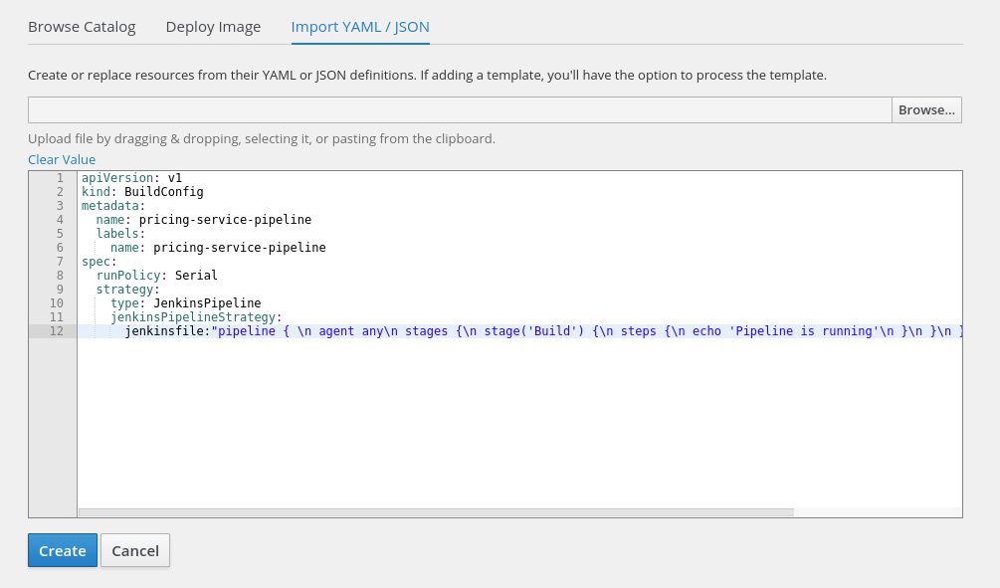

Before we look further at the `pipeline` code, let's note the
other things that are happening. If we get to the main view of the web
console, we will note that there is a new resource:

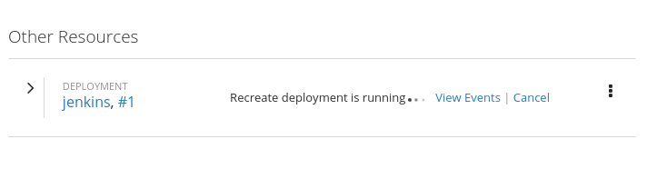

Let's take a look at the currently available **`Pods`** too:

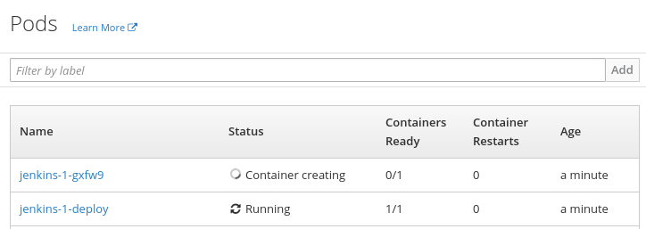

Indeed, there is a new deployment of Jenkins server running, and the
container for the Jenkins server is being created. OpenShift runs a
`pipeline` build using the Jenkins server. Therefore, whenever
you create a `pipeline`, OpenShift must check whether there is
a Jenkins server present in the cluster. If not, OpenShift will start
one automatically. 

The creation of the Jenkins server takes some time, so we have to wait
till it has been deployed. After we are able to see that the application
is running in the **`Pods`** view, we are ready to start the build of
our first `pipeline`.

In order to do that, let's navigate to **`Build | `****`Pipelines`**.
You will be able to see that there is a new `pipeline`
present:

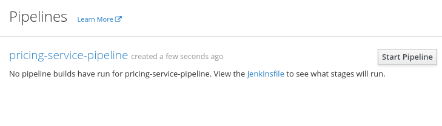

Let's click on the **`Start Pipeline`** button and see what happens:

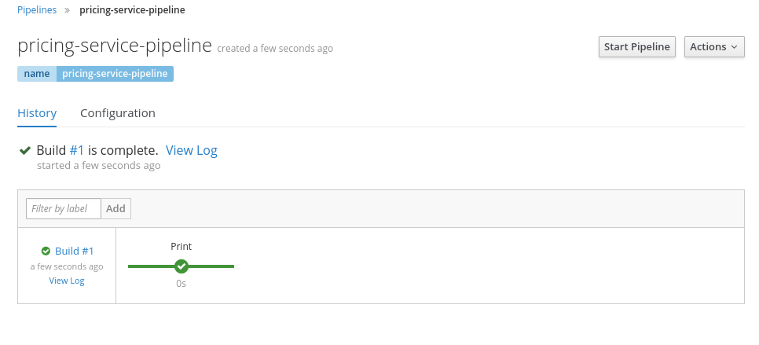

Note in the preceding screenshot that the build has run. The dot with
the tick described as Print means that one stage has been run and that
it has been successful. We will be talking about the Jenkins
`pipeline` structure in just a moment. Now, let's take a look
at more information about our current build by clicking on the
**`View Log`** button:

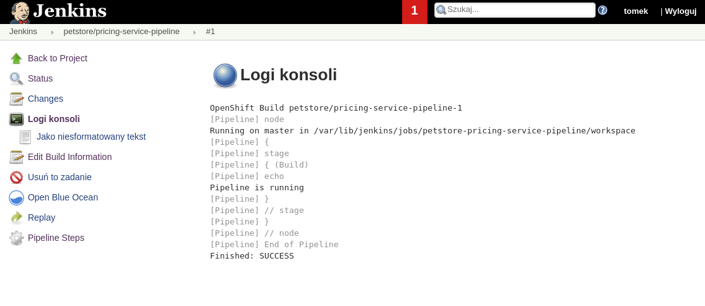

As you will have noticed in the preceding screenshot, we have been
redirected to the Jenkins console. The build has been created, the
**`Print`** stage has been executed, and the print message that we have
echoed has indeed been written to a log. 

As you can see, the `pipeline` build configuration has been
automatically turned into the Jenkins build and run in the Jenkins
console. We will get more information about the build when we click on
**`petstore/pricing-service-pipeline`** in the top-left corner of the
screen:

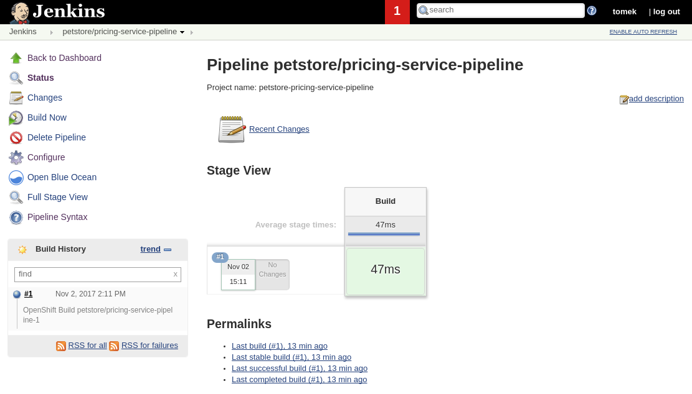

From this window, we can trace the build history, view the logs and time
of the latest execution, or edit the`pipeline`, among others.
At this point, it is good to look again at the script that we have
written in order to create the `pipeline`. You probably have
noted immediately that the Jenkins `pipeline` was squashed
into one line, making it hard to read and edit. Before we take any other
steps, let's find a human way to edit our `pipeline`.

In order to do that, let's click on the **`Configure`** button on the
left-hand side menu and scroll down:

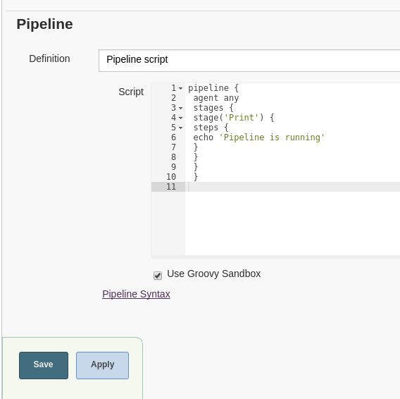

We have a good editor for our `pipeline` here. Let's make our
first edit of the file: 

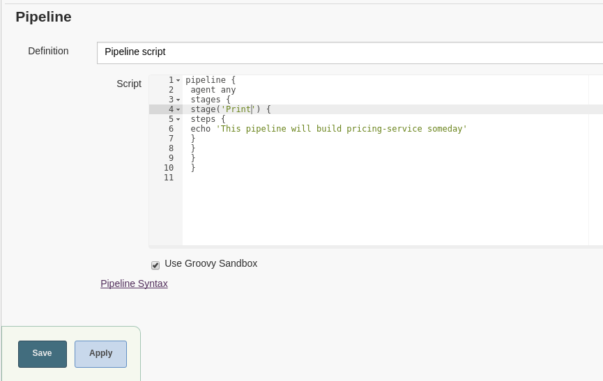

We will then test it to check whether it works. In order to do that, we
have to save the `pipeline` and click on the
**`Build Now`** button in the build view. After that, we are ready to
examine the log by clicking on the second build that has just been
executed:

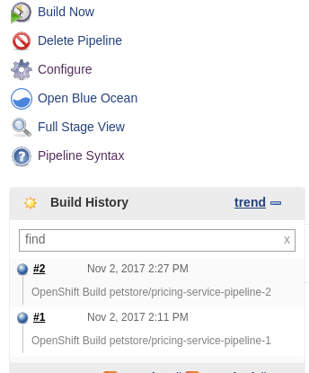

We will see the new log as follows:

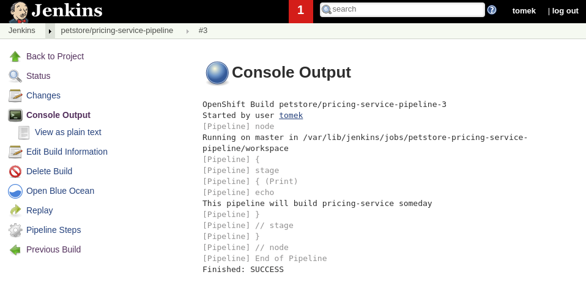

Also, let's log in again to the web console and examine that
`pipeline` there:

**``**

**``**

As you will have noticed, the `pipeline` build config was
modified accordingly to the changes that we have made in Jenkins. We
will perform our future changes using the Jenkins server.

The new message that we are printing in the build promises that our
build will do something useful at some point. After all, we want to
create a CD `pipeline` for our services and not print
messages. Before we can do it though, we will need to learn a few more
things. In the beginning, we will need to say a few more words about the
language that we are using to define the `pipeline`.

### Pipeline syntax language

When we wrote our first `pipeline`, we used the Jenkins
declarative pipeline language. We will describe the essentials of the
**Declarative Pipeline Language** (**DPL**) in the next section.

#### Core pipeline elements

In order to do that, let's return to the `pipeline` that we
executed in the preceding section:

```
//1
pipeline {
    //2
    agent any
    //3
    stages {
        //4
        stage('Print') {
            steps {
                echo 'This pipeline will build pricing-service one day'
            }
        }
    }
}
```

Each `pipeline` in DPL must be enclosed with
the `pipeline` block (1).

The `pipeline` must begin with the `agent` directive
(2). This directive specifies the Jenkins builder machines in which the
build stages (more about them in a moment) can be executed. This setting
can be overridden in each of the stages. In our examples, we will use
any agent for all the stages.

The core `pipeline` build blocks are the stages. The stages
are meant to map to the stages in the CD `pipeline`. They are
defined in a serial order, and each stage can execute only if the stage
before has succeeded.

The stages have to be enclosed with the `stages` (3) block.
Each stage (there need to be at least one of them) has its own
`stage` block with the name specified as a parameter.

Each stage block can contain a bunch of directives followed by the steps
block, which encloses one or more steps that will be executed in the
`pipeline`.

Now, we are getting to the key point. What are the available steps that
we can execute? Jenkins provides a very large number of different steps
provided by different plugins. We will concentrate on one specific
plugin that makes it easy to develop and execute operations on OpenShift
clusters—let's discuss OpenShift, the `pipeline` Jenkins
plugin (Further reading, link 1).

#### Standard Maven operation

The first stage that we will implement is the unit testing stage. In the
beginning, we will add a simple unit test. We have to extend `pom.xml`:

```
(...)


    <dependencies>
        (...)
        <dependency>
            <groupId>org.postgresql</groupId>
            <artifactId>postgresql</artifactId>
            <version>${version.postgresql}</version>
        </dependency>

        //1
        <dependency>
            <groupId>junit</groupId>
            <artifactId>junit</artifactId>
            <version>${version.junit}</version>
            <scope>test</scope>
        </dependency>

        //2
        <dependency>
            <groupId>org.jboss.arquillian.junit</groupId>
            <artifactId>arquillian-junit-container</artifactId>
            <scope>test</scope>
        </dependency>

        //3
        <dependency>
            <groupId>org.wildfly.swarm</groupId>
            <artifactId>arquillian</artifactId>
            <version>${version.wildfly.swarm}</version>
            <scope>test</scope>
        </dependency>

        //4
        <dependency>
            <groupId>com.h2database</groupId>
            <artifactId>h2</artifactId>
            <version>${version.h2}</version>
            <scope>test</scope>
        </dependency>

    </dependencies>

    (...)


</project>
```

Recall that we had to add dependencies for JUnit (1), Arquillian (2),
Swarm's Arquillian adapter (3), and the in-memory database that we will
use (4).

Secondly, we have to provide test resources, namely
`persistence.xml`:

```
<?xml version="1.0" encoding="UTF-8"?>
<persistence
xmlns:xsi="http://www.w3.org/2001/XMLSchema-instance"
version="2.1"
xmlns="http://xmlns.jcp.org/xml/ns/persistence"
xsi:schemaLocation="http://xmlns.jcp.org/xml/ns/persistence http://xmlns.jcp.org/xml/ns/persistence/persistence_2_1.xsd">
<!-- 1 -->
<persistence-unit name="PricingPU" transaction-type="JTA">
<!-- 2 -->
<jta-data-source>java:jboss/datasources/PricingDS</jta-data-source>
        <properties>
<!-- 3 -->
<property name="javax.persistence.schema-generation.database.action" value="drop-and-create"/>
            <property name="javax.persistence.schema-generation.create-source" value="metadata"/>
            <property name="javax.persistence.schema-generation.drop-source" value="metadata"/>

            <property name="javax.persistence.sql-load-script-source" value="META-INF/load.sql"/>
        </properties>
    </persistence-unit>
</persistence>
```

And the load script that we are going to use to test the database:

```
DROP TABLE IF EXISTS PRICE;

CREATE TABLE PRICE (id serial PRIMARY KEY, name varchar, price smallint);

INSERT INTO PRICE(name, price) VALUES ('test-pet', 5);
```

Ensure that we also add the `h2` driver module:

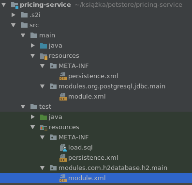

We are now ready to write a test:

```
package org.packt.swarm.petstore.pricing;

import org.jboss.arquillian.container.test.api.Deployment;
import org.jboss.arquillian.junit.Arquillian;
import org.jboss.shrinkwrap.api.ShrinkWrap;
import org.jboss.shrinkwrap.api.asset.EmptyAsset;
import org.jboss.shrinkwrap.api.spec.JavaArchive;
import org.junit.Assert;
import org.junit.Test;
import org.junit.runner.RunWith;
import org.wildfly.swarm.Swarm;
import org.wildfly.swarm.arquillian.CreateSwarm;
import org.wildfly.swarm.datasources.DatasourcesFraction;
import org.wildfly.swarm.jaxrs.JAXRSArchive;
import org.wildfly.swarm.spi.api.Module;

import javax.inject.Inject;

//1
@RunWith(Arquillian.class)
public class PricingServiceTest {

//2
@Deployment
public static JavaArchive createDeployment() {
return ShrinkWrap.create(JavaArchive.class)
                .addClasses(Price.class, PricingService.class)
                .addAsResource("META-INF/persistence.xml")
                .addAsResource("META-INF/load.sql")
                .addAsManifestResource(EmptyAsset.INSTANCE, "beans.xml");
}

//2
@CreateSwarm
public static Swarm createSwarm() throws Exception {
        DatasourcesFraction datasourcesFraction = new DatasourcesFraction()
//3
.jdbcDriver("h2", (d) -> {
                    d.driverClassName("org.h2.Driver");
d.xaDatasourceClass("org.h2.jdbcx.JdbcDataSource");
d.driverModuleName("com.h2database.h2");
})
                .dataSource("PricingDS", (ds) -> {
                    ds.driverName("h2");
ds.connectionUrl("jdbc:h2:mem:test;DB_CLOSE_DELAY=-1;DB_CLOSE_ON_EXIT=FALSE");
ds.userName("sa");
ds.password("sa");
});

Swarm swarm = new Swarm();
swarm.fraction(datasourcesFraction);

        return swarm;
}

//3
@Inject
PricingService pricingService;

//4
@Test
public void testSearchById() {
       Assert.assertEquals(pricingService.findByName("test-pet").getPrice(),5);
}
}
```

Now, we are finally ready to write the testing stage. We will like to
make this stage run fast and fail immediately if there are some
problems, without creating an image or changing anything in our
OpenShift model. For this, we will use standard Maven and git from the
command line. 

In order to do this, we need to configure those tools. To do this, we
will have to go to Jenkins configuration in the main menu, click
on **`Manage Jenkins`** and select the tool configuration for **`JDK`**:

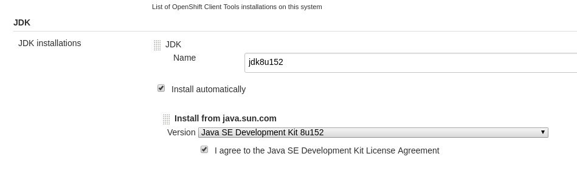

And**`Maven`**:

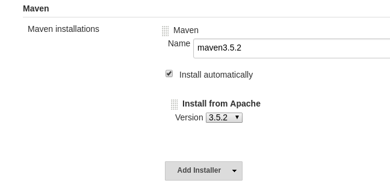

We are finally ready to update our `pipeline`. Let's take a
look:

```
pipeline { 
//1
 agent any
//2 
tools {
    maven 'maven3.5.2'
    jdk 'jdk8u152'
    git 'Default'
 }
 stages {
//3
 stage('Unit tests') {
     steps {
      //4
      git url: 'https://github.com/PacktPublishing/Hands-On-Cloud-Development-with-WildFly.git'
 //5
 sh 'mvn clean test -Dswarm.build.modules=target/test-classes/modules'
 }
 }
}
```

We have provided the mandatory agent any (1) and configured Maven, JDK,
and git tools, providing the versions for all of them. We have replaced
our print stage with the unit test stage (3), which consists of the
following two steps:

1.  The first step clones the **`pricing-service`**'s git repository (4)
2.  The second step runs the Maven tests (5)

### Note

We have to provide the modules directory in order for the tests to work.

OK. So, we have our first stage. Now, what next? If the unit tests pass,
we will like to build and deploy an image with our application. In order
to do that, we will have to interact with our cluster object from within
the `pipeline`. The tool that will help us do that with ease
is the OpenShift Pipeline Plugin. Let's learn more about it.

#### OpenShift Pipeline Plugin

Jenkins has a pluggable architecture, which allows for plugin
development. OpenShift provides its own plugin, which allows for
straightforward operations on OpenShift cluster objects in a declarative
manner. The plugin provides a number of commands. We will introduce them
one by one during the `pipeline` development.

In the beginning, we will write a build stage, which will assemble the
image and ensure that the application works correctly.

The first command that we will use is the `openShiftBuild`
command. It allows running one of the builds defined in the OpenShift
cluster. This command takes one mandatory parameter,
`buildCfg`, which is the name of the build that will be
executed. 

The second command that we will use is verified as `Build`.
This command also takes `buildCfg` and checks whether the last
build of this type has finished successfully within a reasonable time
period. To set the period, we will use the `waitTime`
parameter.

Let's take a look at our new `pipeline`:

```
pipeline { 
 agent any
 tools {
    maven 'maven3.5.2'
    jdk 'jdk8u152'
    git 'Default'
 }
 stages {
 stage('Test') {
     steps {
      git url: 'https://github.com/PacktPublishing/Hands-On-Cloud-Development-with-WildFly.git'
      sh 'mvn clean install -Dswarm.build.modules=target/test-classes/modules'
     }
    }
 //1
 stage('Build') {
     steps {
        //2
        openshiftBuild(bldCfg: 'pricing-service', showBuildLogs: 'true')
        //3
        openshiftVerifyBuild(bldCfg: 'pricing-service', waitTime: '300000')
    }
 }
 }
}
```

We have introduced the `Build` stage (1) and added two steps
to it, as mentioned in the preceding paragraph. The `Build`
command runs the`pricing-service``s2i` build that we
configured at the beginning of this chapter (2). The verify command
checks whether the build was executed successfully within 5 minutes.

### Note

We will like to only build the image here and not deploy it yet. So, we
will need to modify our build and remove the image change as the trigger
for the deployment.

After that, we are ready to start our`Build` in Jenkins. If
you do it and click on console output, you will be able to see the
execution log. Let's take a look at it:

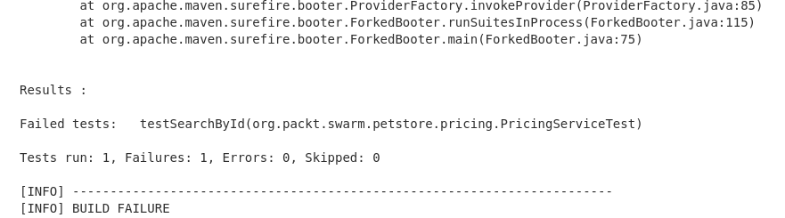

Oops! If you look again at the test, you will note that there is an
error, as the price of the test-pet is 5 none 7. Before we fix it, let's
note how the `pipeline` works. Our first unit test stage
failed immediately. As a result, no further stages were started. No
images were built and no applications were deployed.  Let's also look at
the `pipeline` view on the web console:

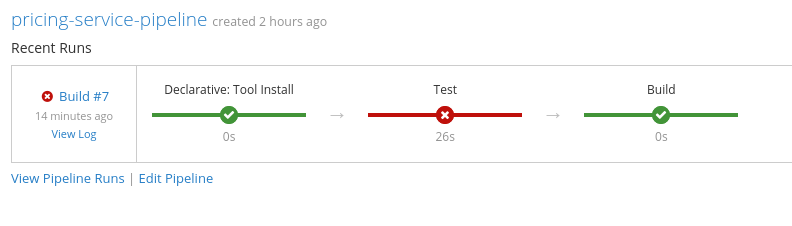

The console presents the `pipeline` execution in a graphic
way, showing that the test stage failed. Let's fix our tests and run the
application again. If you do it and look at the console log, you will be
able to see that the test has passed and the `Build` stage has
been executed:

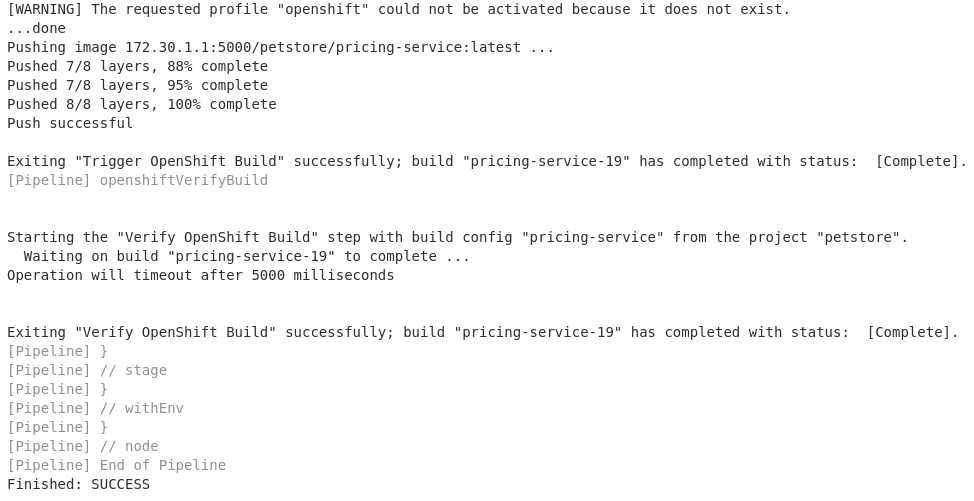

When you take a look at the web console, you will be able to see that
the `Build` has been finished and that the image has been
created:

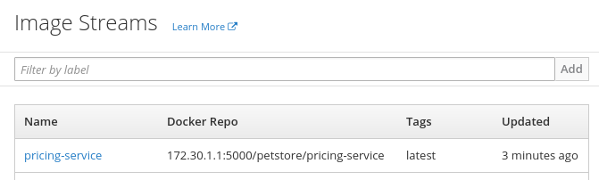

Let's look at the currently available deployments: 

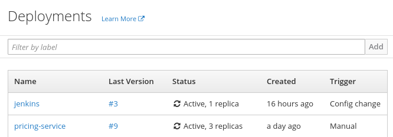

Now, we only have the build image and have not triggered the deployment
yet. Let's add another stage to our build. We will
use`openshiftDeploy`,
`openshiftScale`, `openShiftVerifyDeployment`, and
`openShiftVerifyService`. Before doing that, let's introduce
each of these commands.

The `openshiftDeploy` command takes a mandatory
parameter—`dplCfg`—which is the name of the deployment. It
runs the deployment of an application.

`openshiftScale`, irrespective of a mandatory
`dplCfg` parameter, takes the `replicaCount`
parameter, which specifies the number of replicas of the application.
Since we are using this command to scale the application, we will change
the number of instance deployments in the`deploymentConfig` to
zero. As a result, the pods will be started only after
the `openshiftScale` operation has been executed without an
unnecessary rescale.

`openShiftVerifyDeployment` has the same mandatory parameter
as the two previous commands—`dplCfg`. This command has three
optional parameters, and we will use all of them:

-   `replicaCount`: This parameter specifies the expected
    number of replicas
-   `verifyReplicaCount`: This is a Boolean parameter, which
    specifies whether the replica count should be checked
-   `waitTime`: This indicates the time in milliseconds in
    which we should wait for the verification
-   `openshiftVerifyService`: This command checks whether the
    service is available

`openshiftVerifyService` has one mandatory parameter:

-   `svcName`
-   One optional parameter `retryCount` specifies how many
    times the connection is attempted before declaring the verification
    invalid

Before showing you the new script, we will introduce one more concept.
As we mentioned in the theoretical section of this chapter, the build
should give immediate feedback to its authors regarding its status. In
order to react to the `Build` status, the DPL provides the
ability to perform an action after the `pipeline` is finished
based on the status of the build. The construct that allows doing that
is post directive.

A post directive enables us to perform an action after the build has
been finished. It can be placed at the end of the `pipeline`
or at the end of each stage. The post directive provides a bunch of
subdirectories: always, success, failure, unstable, (runs if the build
is unstable—the result changes during the build) aborted, and changed. 

In our script, for the sake of simplicity, we will echo the build status
to the console, but we can use the available Jenkins plugins0; to
configure email, HipChat, or slack notification.

Let's take a look at the build:

```
pipeline { 
 agent any
 tools {
    maven 'maven3.5.2'
    jdk 'jdk8u152'
    git 'Default'
 }
 stages {
 stage('Test') {
     steps {
      git url: 'https://github.com/PacktPublishing/Hands-On-Cloud-Development-with-WildFly.git'
      sh 'mvn clean install -Dswarm.build.modules=target/test-classes/modules'
     }
    }
 stage('Build') {
     steps {
        openshiftBuild(bldCfg: 'pricing-service', showBuildLogs: 'true')
        openshiftVerifyBuild(bldCfg: 'pricing-service', waitTime: '300000')
    }
    }
//1
 stage('Deploy'){
     steps {
         //2
         openshiftDeploy(depCfg: 'pricing-service')
         //3
         openshiftScale(depCfg: 'pricing-service',replicaCount:'3')
         //4
         openshiftVerifyDeployment(depCfg: 'pricing-service',verifyReplicaCount:'true',replicaCount:'3', waitTime: '300000')
         //5
         openshiftVerifyService(svcName: 'pricing-service')
     }
 }
 }
 post {
    //6
    success {
        echo "Job '${env.JOB_NAME} [${env.BUILD_NUMBER}]' result: SUCCESS"
    }
    //7
    failure {
        echo "Job '${env.JOB_NAME} [${env.BUILD_NUMBER}]' result: FAILURE"
    }
 }
}
```

We have extended our `pipeline` in a way described previously:

1.  We have added the `Deploy` stage (1), which deploys the
    application (2)
2.  Then, it scales the application (3)
3.  It verifies that the deployment succeeded (4) and that the service
    is available (5)
4.  After each build, the result of the test is echoed to the output,
    depending on whether the test succeeded (6) or failed (7)

If you look at the console output, you will be able to see that all the
steps that we have implemented have been executed successfully.

You can also verify this in the web console `pipeline` view:

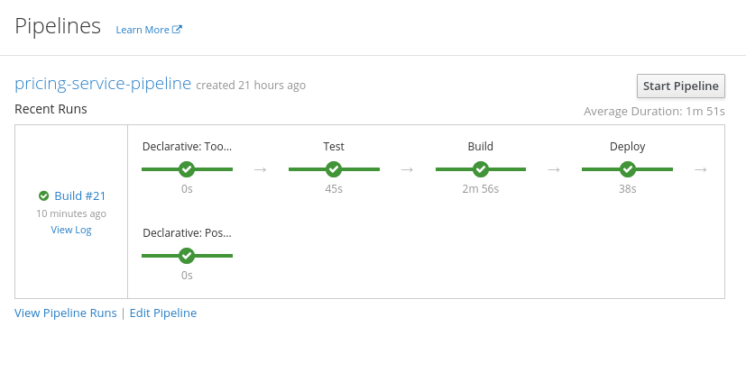

Finally, you can verify in the web console that the service has indeed
been created and that the corresponding pods are running.
