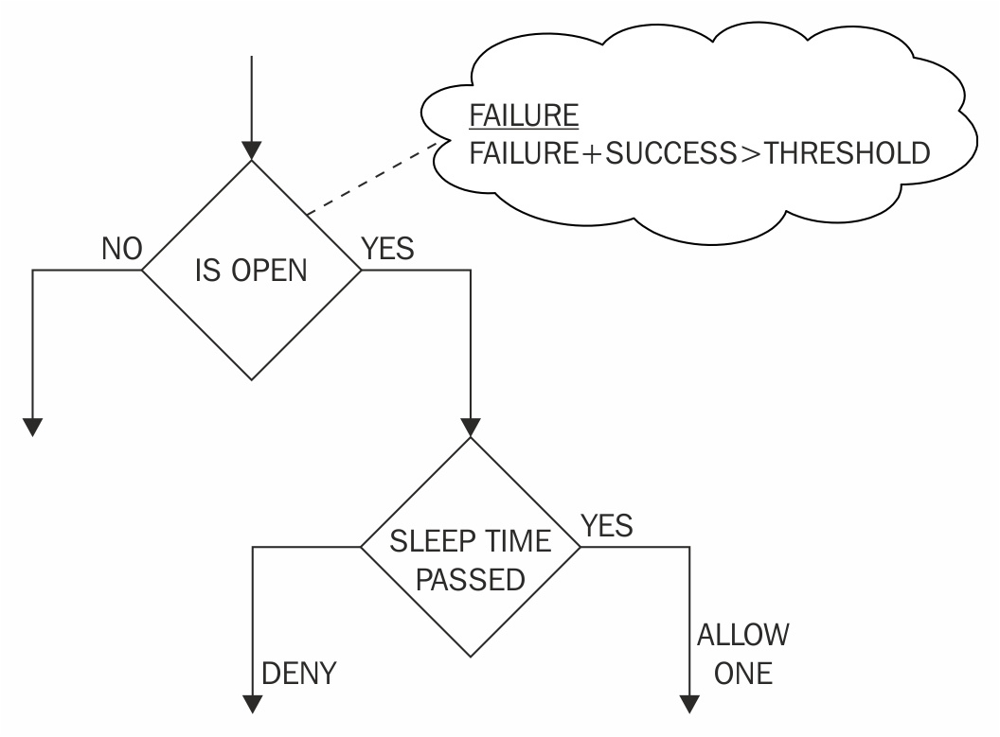
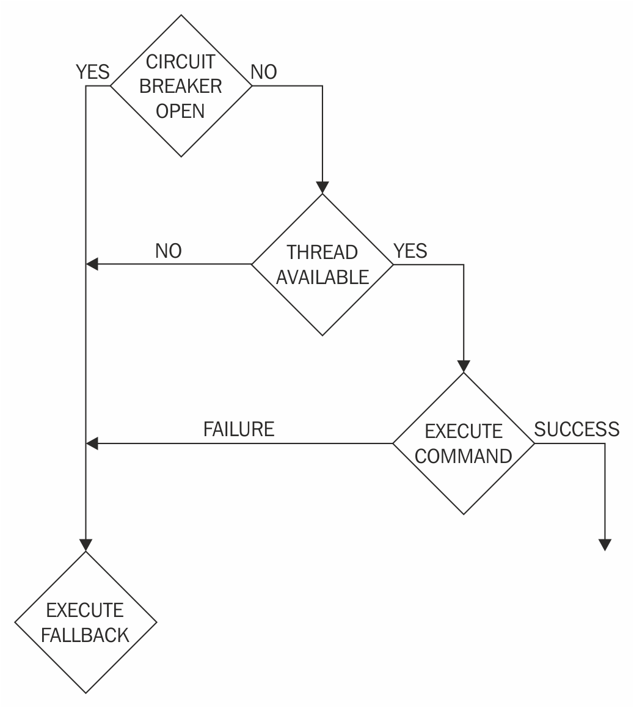
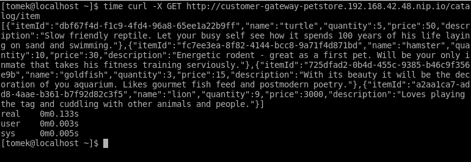
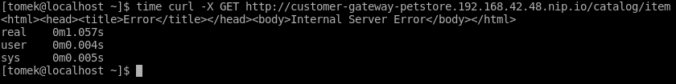
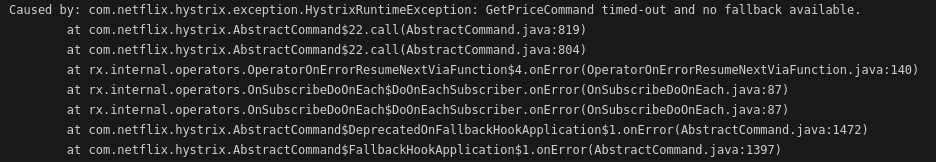
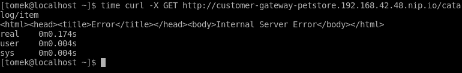
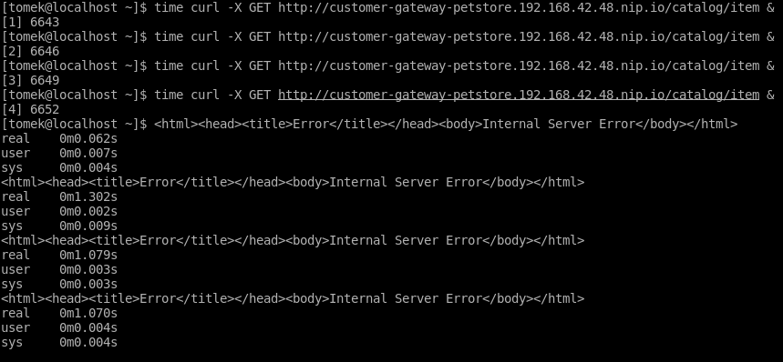
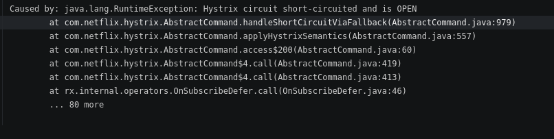
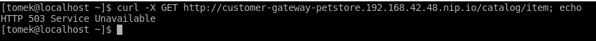

# Lab : Adding Resilience Using Hystrix
In this episode, we will learn how to deal with network failures, which are inevitable in a distributed environment. In order to do that, we will introduce the circuit breaker architectural pattern and cover when it should be used, and what its benefits are. We will look at its Netflix implementation, Hystrix. We will also cover how it is implemented and how it can be used. As an example, we will use Hystrix to add resilience and fault tolerance to our sample application.

#### Pre-reqs:
- [Openshift Wildfly Lab](https://www.katacoda.com/athertahir/courses/cloud-development-with-wildfly/cloud-development-with-wildfly-chapter-07) 

Unreliable network
------------------

* * * * *

When you develop your services for distributed environments, you must
take into consideration that invocations of the services will be
performed over the network. As a result, the application must be
prepared to deal with network failures, which will certainly happen.

This problem is further enhanced by the fact that a single misbehaving
service can poison a large number of services. Let's take a look at the
number of scenarios, that can make this possible.

### Dependent services

In large distributed systems, each service would have a large number of
dependencies on other services. It requires only one dependency to fail
to make the service irresponsible. Also, a service will go down too,
becoming unavailable for other services that depend on it. Such a
situation is known as cascading failures (Further reading, link 1).

However, that's not all. In a production-ready environment when there
are a lot of calls being performed, a service that has latency problems
will quickly block all available threads and make all other services
unreachable.

Clearly, if we want to design a robust distributed system, we will need
to have a tool that will enable users to deal with the problems
described previously. The tool that we will use is the Hystrix library.

Hystrix is a library developed by Netflix to deal with service failures
and to provide robustness for its sophisticated distributed
architecture. Let's find out how Hystrix deals with the problems
previously described.

The circuit breaker pattern
---------------------------

* * * * *

The architectural design pattern created to deal with the problems
described previously is the circuit breaker pattern. The main idea
behind it is simple: wrap the invocation code into the command, which
will perform the invocation, and calculate the status of the remote
service. If the service is declared unreachable by the metrics used by
the command, then the next invocations are rejected immediately. After a
given time, new connections will be tried again, and, if successful, the
command will start performing invocations to the service again.

The name of the pattern was taken from the electrical circuit breaker, a
device used to protect the electrical circuit from the damage that may
result from the excess electrical current. If the current in the circuit
is too high then the circuit breaker opens, preventing the current from
flowing. In order to make the circuit operate again, the circuit breaker
has to be closed.

Owing to its archetype, the software circuit breaker has inherited the
electrical nomenclature. If the targeted service is healthy and the
invocations are forwarded to it directly, we will be talking about
closed breaker. If the health metrics are exceed, the invocations are
not performed, and the circuit breaker will be opened.

Obviously, the library that is responsible for the implementation of the
circuit breaker has to provide algorithms that decide whether the remote
service is healthy, how and when to open the circuit, and what to do if
a circuit breaker is closed. Let's discuss how Hystrix does it.

### The Hystrix circuit breaker

The following diagram presents the behavior of the Hystrix circuit
breaker:



During the invocation of the remote service, Hystrix checks whether the
circuit breaker is open. This decision is made based on the statistics
gathered from the recent invocations. If the percentage of failures in
the last time window is lower than the configured threshold, then the
circuit is open and the invocation is performed.

After the invocation is performed, the circuit breaker stores its result
(success/failure) in the statistics. The statistics are gathered for the
configured time window, which is further divided into the number of
buckets, with only one bucket being discarded at a time so that the data
for the given window is not discarded all at once.

What happens when the circuit is open? Firstly, the algorithm checks
whether the configured sleep time has passed. If it is the case, then
only one request is allowed to be executed. This stage of a circuit
breaker is called half-open and its purpose is to check whether the
invoked service is healthy again. If the invocation succeeds, then a
circuit breaker is opened again and the metrics are reset. If, on the
other hand, the sleep time has not exceeded or the one invocation in a
half-open state has failed, then the circuit breaker is opened again and
the sleep time is reset.

So, we now know the Hystrix circuit breaker algorithm and how it reacts
to statistics on successful and failed invocation. However, how do we
actually define failure? There are three cases when the invocation is
marked as failed. First, the configured invocation timeout has been
exceeded. Second, the client library has thrown an exception. Third, the
number of threads available for a given dependency has been exceeded.

The last point is an implementation of the bulkheading algorithm. Let's
learn more about it.

### Bulkheading

In order to prevent a situation in which one of the dependencies uses
the whole thread pool of an application, Hystrix keeps the thread pool
for each dependency. If one of the dependencies becomes latent, it will
keep all its threads busy and will reject further invocations, resulting
in an increased failure count.Such a strategy is called **bulkheading**.

This time, the nomenclature is taken from ship engineering: the hull of
the ship is divided into isolated bulkheads so that the hull damage in
one place results in only one bulkhead being filled with water.
Similarly, providing a thread pool for each of the dependencies results
in only a dedicated thread pool being used if one of the services is
misbehaving.

In complex distributed environments, it is often the case that the
application has many dependencies, each of which depends on other client
libraries. Often, such libraries are black boxes provided by a
third-party company, making them hard to debug. In addition, increasing
the number of those libraries increases the risk that one of them will
*poison* the whole application. With bulkheading, you can easily
mitigate this risk.

### Note

The state of each client can be easily tracked by the status of its
thread pool. If monitoring shows that one of the thread pools is full,
it is an indicator that it should be examined. If the underlying problem
is fixed, the thread pool will clear up and the service will continue
its operation.

The dependencies that share the same thread pool are configurable. As a
result, you are able to tune bulkheading behavior according to your
architecture. Such a configuration is done using Hystrix group
mechanism, which we will show you in the examples later in this episode.

So, we already know that the invocation may fail or be forced to fail by
Hystrix. But, what happens in that scenario? The mechanism that is
supposed to deal with invocation failures is called **fallbacks**. Let's
learn more about it now.

### Fallbacks

Hystrix implements a fallbacks mechanism, which allows you to execute
your code whenever the failure of the invocation happens. The command
allows you to implement a fallback method, which will be executed during
the failure. The method is executed regardless of the cause of the
failure—the same method will be executed in case of timeout or thread
pool overflow.

The fallback method doesn't have to be implemented. If fallback is not
implemented, the exception thrown by Hystrix will be propagated down the
stack trace.

If, on the other hand, you decide to implement the fallback, you have a
number of strategies for doing that. Let's take a look at a few
examples.

If you are using a service that is used to read a data, you can return
an empty answer in case of invocation failure. In such a scenario, no
data will be available in case of service failure. This solution hides
the underlying failure and immediately returns the response. The problem
is, obviously, that the requested data is unavailable. You can deal with
that by implementing the local cache and return the latest response in
case of failure. In this scenario, the failure will be hidden and the
data will be available. It won't be up to date for the time of failure,
but it will allow your system to continue its operation.

Let's suppose now that you are using the authorization service to decide
whether the user is authorized to perform some further operations. In
this case, you can implement the fallback, which will always return the
same response. However, what should this response be? As usual, it
depends on your use case. In some scenarios, you may want to avoid a
situation when a user who has paid for a service is unable to use it. In
this scenario, you would return the successful authorization each time.
The drawback is that a number of users will be able to use content that
they haven't paid for at the time of authorization service failure. In
other scenarios, you may need to deny authorization for all users.
Surely the temporary allow-all strategy is not suitable for the bank
application. In this case, you would have to deny the authorization for
all users.

Finally, in some scenarios, not writing the fallback is a good strategy.
Let's suppose that you are implementing an invocation that is supposed
to modify some data as a part of transactional operations. In this
scenario, the propagated exception is the strategy that we want: the
whole operation will be stopped, and the exception will be propagated to
the transaction manager, which will roll back the transaction.

In this section, we have only hinted at a number of possible fallback
implementation strategies. As you may have noticed, the specific
implementation (or lack of) depends directly on your service's business
requirements. The key point to remember is that Hystrix won't allow the
network failure to compromise the behavior of your application, and if a
failure occurs it will allow you to deal with it using the fallback
mechanism.

### The whole algorithm

Finally, we are ready to sum up the behavior of the Hystrix library:



At the beginning, the user constructs the command and starts its
execution. Hystrix checks whether the circuit breaker associated with
this command is closed. If the circuit breaker is open, then the
invocation will be rejected immediately and the fallback will be
executed (if implemented). If the circuit breaker is closed, then the
thread-pool is checked. If there are no available threads in the
thread-pool, then the invocation fails; optionally, the fallback is
executed and the failure is reported to the circuit breaker. If, on the
other hand, there are threads available, then the invocation starts. If
the invocation misses its timeout, then the failure is reported to the
circuit breaker and the optional fallback is executed.

### Note

In this scenario, the thread may be blocked. Hystrix will time it out,
but will have to wait for the client library to *return the thread*. If
the invocation finishes and fails, then the failure is reported to the
circuit breaker and optionally the fallback is executed.

Finally, if the execution succeeds, then the success is reported to the
circuit breaker and the response is returned as the result of the
command execution.

You have already learned the basics of the Hystrix's circuit breaker
implementation. Now it is time to learn its basic API, which we will use
later in this episode. Let's do it now.

Using Hystrix
-------------

* * * * *

In order to learn Hystrix behavior in practice, we are going to extend
customer-gateway service so that it uses Hystrix for its invocations.
Later, we are going to make one of our services artificially
unresponsive and see how Hystrix behaves. Let's start.

### Note

Examples reference: `chapter11/customer-gateway-hystrix`.

Firstly, we are going to add Hystrix dependency to the
`pom.xml`:

```
(...)

<dependency>
    <groupId>com.netflix.hystrix</groupId>
    <artifactId>hystrix-core</artifactId>
    <version>${version.hystrix}</version>
</dependency>

(...)
```

The circuit breaker command is implemented by extending the
`com.netflix.hystrix.HystrixCommand` class. Let's take a look
at its usage at the concrete example of our `PricingProxy`:

```
(...)

@ApplicationScoped
public class PricingProxy {

    (...)

    //1
    private class GetPriceCommand extends HystrixCommand<Response> {

private final String itemId;

        //2
        public GetPriceCommand(String itemId) {
            //3
            super(Setter.withGroupKey(HystrixCommandGroupKey.Factory.asKey("pricing-service"));
            this.itemId = itemId;
        }

        @Override
        //4
        protected Response run() {
            //5
            Client client = ClientBuilder.newClient();
            WebTarget target = client.target(targetPath + "/price/" + itemId);
            return target.request(MediaType.APPLICATION_JSON).get();
        }
    }
}
```

The command has to extend the abstract `HystrixCommand` class
(1). The class has to be parameterized with a type that will be returned
as the command result. In our example, it will be the JAX-RS response
class—the same as we used in our raw invocation.

The class takes the itemId parameter as an argument (2), which will be
used in the invocation.

As you can see in the constructor code, we have provided
`HystrixCommandGroupKey` parameter to it (3).
`HystrixCommand` constructors allow you to provide a
combination of three arguments: `HystrixCommandGroupKey`,
`HystrixThreadPoolKey`, and the timeout. The two enum
parameters are used for command grouping: the commands with the same
group key will belong to the same group and will be grouped together for
the purpose of reporting, alerting, and monitoring. The thread pool key
specifies the commands that belong to the same Hystrix thread pool used
by the bulkhead algorithm. When the thread pool key is not enabled, the
group key is used as the thread pool identifier.

As a result, in our example all the `pricingService`
invocation commands will belong to the same group and will use their own
thread pool. The third argument in the
`HystrixCommand `constructors is the timeout of the
invocation. If one is not provided, the default timeout is used.

We have to extend the `run` method of the HystrixCommand class
(4). This method will be invoked when the command is executed. As you
can see (5), the content of the method is the same as the code of the
proxy in our raw invocation.

Now, let's take a look at how to execute the command:

```
(...)

@ApplicationScoped
public class PricingProxy {

    private final String targetPath = System.getProperty("proxy.pricing.url");

    //1
    public Price getPrice(String itemId){
        //2
        return new GetPriceCommand(itemId).execute().readEntity(Price.class);
    }

    (...)
}
```


`oc delete all -l app=customer-gateway`

`oc new-app wildflyswarm-10-centos7~https://github.com/PacktPublishing/Hands-On-Cloud-Development-with-WildFly.git --context-dir=chapter11/customer-gateway-hystrix --name=customer-gateway`

`customer-gateway-petstore.<update-me>-80-<update-me>.environments.katacoda.com/catalog/item`


The getPrice method of the proxy (1) creates the command object (2) and
invokes the `execute()` method on it. This results in the
execution of the whole circuit breaker algorithm described in the
theoretical section. Let's invoke the catalog/item method now and
measure the time of its invocation:



There is no difference; the invocation is executed immediately without
any errors. Now, let's make `pricingService` artificially
unresponsive.

### Note

Examples reference: `chapter11/pricing-service-misbehave`.

In order to do that we are going to make the service wait a specified
amount of time before returning a result:

```
package org.packt.swarm.petstore.pricing;

import org.packt.swarm.petstore.pricing.model.Price;

import javax.enterprise.context.ApplicationScoped;
import javax.persistence.EntityManager;
import javax.persistence.PersistenceContext;
import java.util.List;
import java.util.concurrent.TimeUnit;
import java.util.concurrent.locks.LockSupport;

@ApplicationScoped
public class PricingService {

@PersistenceContext(unitName = "PricingPU")
private EntityManager em;

    public Price findByItemId(String itemId) {
        //1
        LockSupport.parkNanos(TimeUnit.SECONDS.toNanos(5));
        return em.createNamedQuery("Price.findByItemId", Price.class).setParameter("itemId", itemId).getSingleResult();
}
}
```

Let's deploy the new service to the cloud and retry an invocation. The
result is as follows:



As you will have noticed in the preceding screenshot, the invocation has
resulted in failure. The circuit breaker was open, and there was a
thread available in the thread pool. As a result, the invocation was
performed, but it exceeded the default Hystrix timeout which equals 1
second.

To confirm this, let's look at the logs:



Hystrix does not lie here: the timeout was exceeded and we have
implemented no fallback. We will do in a second, but before that let's
learn how to modify Hystrix properties.

If you want to modify the configuration of `HystrixCommand`,
you have to use the constructor with the `Setter` argument.
This class allows you to configure all the constructor arguments
described previously. Apart from that, the class allows you to provide
the configuration properties for different aspects of the circuit
breaker behavior. The exhaustive list of such properties is described in
the Hystrix documentation. Here, we will present a few example
modifications. Let's start with the circuit breaker timeout:

```
(...)
private class GetPriceCommand extends HystrixCommand<Response> {

private final String itemId;

    public GetPriceCommand(String itemId) {
        //1
        super(Setter.withGroupKey(HystrixCommandGroupKey.Factory.asKey("pricing-service"))
                .andCommandPropertiesDefaults(HystrixCommandProperties.Setter()
        //2
                        .withExecutionTimeoutInMilliseconds(100)));
        this.itemId = itemId;
}

@Override
protected Response run() {
        Client client = ClientBuilder.newClient();
WebTarget target = client.target(targetPath + "/price/" + itemId);
```

```
        return target.request(MediaType.APPLICATION_JSON).get();
}
}
(...)
```

The preceding code modifies our command class in order to shorten the
invocation timeout to 500 milliseconds. The `Setter` class is
used, and the`CommandGroupKey` is set in the same way as in
the examples before (1). In order to modify the configuration, we have
added `HystrixCommandProperites.Setter` with the appropriate
configuration (2). Now, let's take a look at the following result:



Let's reconfigure the application to note the behavior of the
bulkheading algorithm; we will increase the timeout and reduce the
number of threads:

```
(...)private class GetPriceCommand extends HystrixCommand<Response> {

private final String itemId;

    public GetPriceCommand(String itemId) {
super(Setter.withGroupKey(HystrixCommandGroupKey.Factory.asKey("pricing-service"))
//1.andThreadPoolPropertiesDefaults(HystrixThreadPoolProperties.Setter().withCoreSize(3));
        this.itemId = itemId;
}

@Override
protected Response run() {
        Client client = ClientBuilder.newClient();
WebTarget target = client.target(targetPath + "/price/" + itemId);
        return target.request(MediaType.APPLICATION_JSON).get();
}
}
(...)
```

In order to do that, another setter (this time, the
`HystrixThreadPoolProperties` setter) has to be created (1).

The result is as follows:



As you will have noticed in the preceding screenshot, the first three
invocations have obtained their threads and were blocked. The fourth
thread returned immediately as there are no more threads in the thread
pool.

Finally, let's open the circuit. If we run the code in a bash loop and
look into the log, we will note the following result:



Finally, let's implement the fallback:

```
(...)
private class CreatePaymentCommand extends HystrixCommand<Response> {

private final Payment payment;

    public CreatePaymentCommand(Payment payment) {
super(Setter.withGroupKey(HystrixCommandGroupKey.Factory.asKey(SERVICE_NAME))
                              .andCommandPropertiesDefaults(HystrixCommandProperties.Setter()
                                      .withExecutionTimeoutInMilliseconds(100)));
        this.payment = payment;
}

@Override
protected Response run() {
        Client client = ClientBuilder.newClient();
WebTarget target = client.target(targetPath + "/payment");
        return target.request(MediaType.APPLICATION_JSON).post(Entity.json(payment));
}

    @Override
    //1
    protected Response getFallback() {
//2
        return Response.status(Response.Status.SERVICE_UNAVAILABLE).build();
    }
}

(...)
```

In order to implement the fallback, you have to override the
`getFallback` method (1). In our example, we have returned the
`SERVICE_UNAVAILABLE` exception whenever the
`paymentService` is unreachable (2).

We can now reimplement the`PetstoreService` so that it creates
a meaningful exception whenever such situations occur:

```
public String buy(int customerId){
    Cart cart = cartProxy.getCart(customerId);

Order order = createOrderFromCart(customerId, cart);
    int orderId  = orderProxy.createOrder(order);

Payment payment = new Payment();
payment.setMerchantId(Constants.MERCHANT_ID);
payment.setDescription(String.format("ORDER_ID: %s", orderId));
payment.setAmount(order.getPrice());

Response response =  paymentProxy.createPayment(payment);

    if(response.getStatus() == Response.Status.SERVICE_UNAVAILABLE.getStatusCode()){
        throw new RuntimeException("Payment service unreachable");
    }

return (String) response.readEntity(String.class);
}
```

`oc delete all -l app=pricing-service`

`oc new-app wildflyswarm-10-centos7~https://github.com/PacktPublishing/Hands-On-Cloud-Development-with-WildFly.git --context-dir=chapter11/pricing-service-misbehave --name=pricing-service`

`oc expose svc/pricing-service`

`curl -X GET customer-gateway-petstore.<update-me>-80-<update-me>.environments.katacoda.com/catalog/item`


This will be the result of an invocation:


